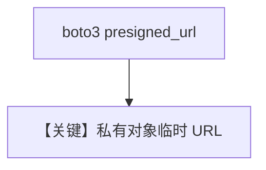

# s3_url_file_input.py — 实现原理分析

<!-- cookbook-py-source:start -->
## 完整源码

```python
"""
Example: Analyze files from AWS S3 using pre-signed URLs.

The Gemini API now supports external HTTPS URLs (up to 100MB).
Generate a pre-signed URL from S3 and pass it directly to Gemini.

Requirements:
- AWS credentials configured (via environment variables or ~/.aws/credentials)
- boto3 installed: uv pip install boto3

Supported formats: PDF, JSON, HTML, CSS, XML, images (PNG, JPEG, WebP, GIF)

Note: External URL support requires Gemini 3.x models (e.g., gemini-3-flash-preview).
      Gemini 2.0 models do not support this feature.
"""

import boto3
from agno.agent import Agent
from agno.media import File
from agno.models.google import Gemini

# ---------------------------------------------------------------------------
# Create Agent
# ---------------------------------------------------------------------------

# Generate a pre-signed URL for your S3 object
# Replace with your own bucket and key for private files
s3_client = boto3.client("s3")
presigned_url = s3_client.generate_presigned_url(
    "get_object",
    Params={
        "Bucket": "agno-public",  # Example: using Agno's public bucket
        "Key": "recipes/ThaiRecipes.pdf",
    },
    ExpiresIn=3600,  # URL valid for 1 hour
)

agent = Agent(
    model=Gemini(id="gemini-3-flash-preview"),
    markdown=True,
)

# Pass pre-signed URL directly - Gemini fetches the content
agent.print_response(
    "What is this document about? Answer in one sentence.",
    files=[
        File(
            url=presigned_url,
            mime_type="application/pdf",
        )
    ],
)

# ---------------------------------------------------------------------------
# Run Agent
# ---------------------------------------------------------------------------

if __name__ == "__main__":
    pass
```

<!-- cookbook-py-source:end -->

> 源文件：`cookbook/90_models/google/gemini/s3_url_file_input.py`

## 概述

**S3 预签名 URL** 作为 `File(url=presigned_url)`，等同外部 HTTPS 输入，`gemini-3-flash-preview`。

**核心配置一览：**

| 配置项 | 值 | 说明 |
|--------|------|------|
| `model` | `Gemini(id="gemini-3-flash-preview")` | |
| `markdown` | `True` | |

## Mermaid 流程图



## 关键源码文件索引

| 文件 | 关键函数/类 | 作用 |
|------|------------|------|
| `agno/media/file.py` | `File` | url |
