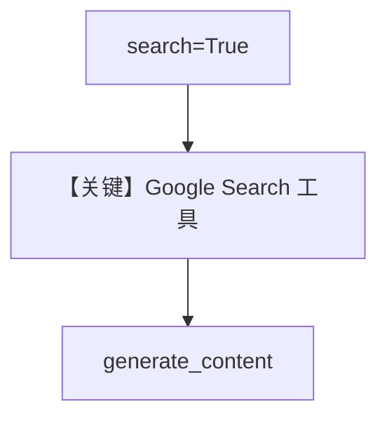

# search.py — 实现原理分析

<!-- cookbook-py-source:start -->
## 完整源码

```python
"""Google Search with Gemini.

The search tool enables Gemini to access current information from Google Search.
This is useful for getting up-to-date facts, news, and web content.

Run `uv pip install google-generativeai` to install dependencies.
"""

from agno.agent import Agent
from agno.models.google import Gemini

# ---------------------------------------------------------------------------
# Create Agent
# ---------------------------------------------------------------------------

agent = Agent(
    model=Gemini(id="gemini-3-flash-preview", search=True),
    markdown=True,
)

# Ask questions that require current information

# ---------------------------------------------------------------------------
# Run Agent
# ---------------------------------------------------------------------------
if __name__ == "__main__":
    # --- Sync ---
    agent.print_response("What are the latest developments in AI technology this week?")
```

<!-- cookbook-py-source:end -->

> 源文件：`cookbook/90_models/google/gemini/search.py`

## 概述

**原生 Google Search 工具**：`Gemini(..., search=True)`，替代旧 grounding 的推荐方式之一。

**核心配置一览：**

| 配置项 | 值 | 说明 |
|--------|------|------|
| `model` | `Gemini(id="gemini-3-flash-preview", search=True)` | |
| `markdown` | `True` | |

## Mermaid 流程图



## 关键源码文件索引

| 文件 | 关键函数/类 | 作用 |
|------|------------|------|
| `agno/models/google/gemini.py` | `search` 参数 | |
