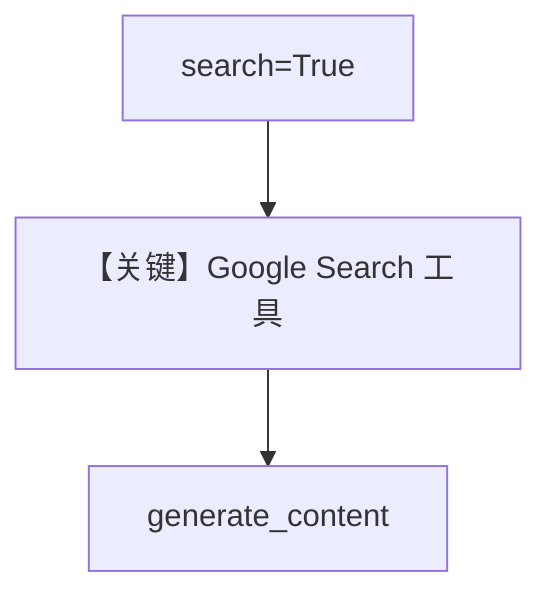

# search.py — 实现原理分析

> 源文件：`cookbook/90_models/google/gemini/search.py`

## 概述

**原生 Google Search 工具**：`Gemini(..., search=True)`，替代旧 grounding 的推荐方式之一。

**核心配置一览：**

| 配置项 | 值 | 说明 |
|--------|------|------|
| `model` | `Gemini(id="gemini-3-flash-preview", search=True)` | |
| `markdown` | `True` | |

## Mermaid 流程图

## 关键源码文件索引

| 文件 | 关键函数/类 | 作用 |
|------|------------|------|
| `agno/models/google/gemini.py` | `search` 参数 | |
