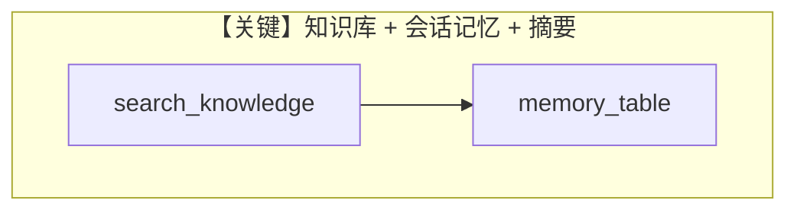

# storage_and_memory.py — 实现原理分析

> 源文件：`cookbook/90_models/google/gemini/storage_and_memory.py`

## 概述

**PDFUrlKnowledgeBase + PgVector + PostgresDb + 会话摘要与记忆**：`search_knowledge=True`，`read_chat_history=True`，`update_memory_on_run=True`，`enable_session_summaries=True`，工具含 `WebSearchTools`。

**核心配置一览：**

| 配置项 | 值 | 说明 |
|--------|------|------|
| `model` | `Gemini(id="gemini-2.0-flash-001")` | |
| `knowledge` | `PDFUrlKnowledgeBase(...)` | `load(recreate=True)` |
| `db` | `PostgresDb(..., memory_table="agent_memory")` | |
| `search_knowledge` | `True` | |
| `read_chat_history` | `True` | |
| `add_history_to_context` | `True` | |
| `num_history_runs` | `6` | |

## Mermaid 流程图

## 关键源码文件索引

| 文件 | 关键函数/类 | 作用 |
|------|------------|------|
| `agno/knowledge/` | `PDFUrlKnowledgeBase` | PDF URL 知识 |
| `agno/agent/agent.py` | 记忆相关标志 | |
