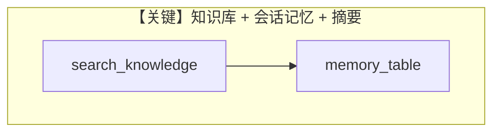

# storage_and_memory.py — 实现原理分析

<!-- cookbook-py-source:start -->
## 完整源码

```python
"""Run `pip install ddgs pgvector google.genai` to install dependencies."""

from agno.agent import Agent
from agno.db.postgres.postgres import PostgresDb
from agno.knowledge import PDFUrlKnowledgeBase
from agno.models.google import Gemini
from agno.tools.websearch import WebSearchTools
from agno.vectordb.pgvector import PgVector

# ---------------------------------------------------------------------------
# Create Agent
# ---------------------------------------------------------------------------

db_url = "postgresql+psycopg://ai:ai@localhost:5532/ai"

knowledge_base = PDFUrlKnowledgeBase(
    urls=["https://agno-public.s3.amazonaws.com/recipes/ThaiRecipes.pdf"],
    vector_db=PgVector(table_name="recipes", db_url=db_url),
)
knowledge_base.load(recreate=True)  # Comment out after first run

agent = Agent(
    model=Gemini(id="gemini-2.0-flash-001"),
    tools=[WebSearchTools()],
    knowledge=knowledge_base,
    # Store the memories and summary in a database
    db=PostgresDb(db_url=db_url, memory_table="agent_memory"),
    update_memory_on_run=True,
    enable_session_summaries=True,
    # This setting adds a tool to search the knowledge base for information
    search_knowledge=True,
    # This setting adds a tool to get chat history
    read_chat_history=True,
    # Add the previous chat history to the messages sent to the Model.
    add_history_to_context=True,
    # This setting adds 6 previous messages from chat history to the messages sent to the LLM
    num_history_runs=6,
    markdown=True,
)
agent.print_response("Whats is the latest AI news?")

# ---------------------------------------------------------------------------
# Run Agent
# ---------------------------------------------------------------------------

if __name__ == "__main__":
    pass
```

<!-- cookbook-py-source:end -->

> 源文件：`cookbook/90_models/google/gemini/storage_and_memory.py`

## 概述

**PDFUrlKnowledgeBase + PgVector + PostgresDb + 会话摘要与记忆**：`search_knowledge=True`，`read_chat_history=True`，`update_memory_on_run=True`，`enable_session_summaries=True`，工具含 `WebSearchTools`。

**核心配置一览：**

| 配置项 | 值 | 说明 |
|--------|------|------|
| `model` | `Gemini(id="gemini-2.0-flash-001")` | |
| `knowledge` | `PDFUrlKnowledgeBase(...)` | `load(recreate=True)` |
| `db` | `PostgresDb(..., memory_table="agent_memory")` | |
| `search_knowledge` | `True` | |
| `read_chat_history` | `True` | |
| `add_history_to_context` | `True` | |
| `num_history_runs` | `6` | |

## Mermaid 流程图



## 关键源码文件索引

| 文件 | 关键函数/类 | 作用 |
|------|------------|------|
| `agno/knowledge/` | `PDFUrlKnowledgeBase` | PDF URL 知识 |
| `agno/agent/agent.py` | 记忆相关标志 | |
