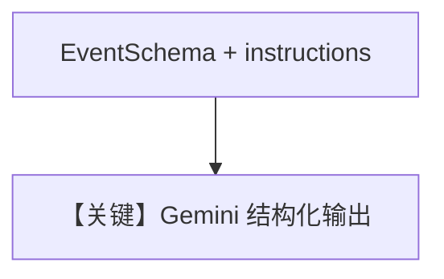

# structured_output.py — 实现原理分析

> 源文件：`cookbook/90_models/google/gemini/structured_output.py`

## 概述

**复杂 Pydantic `EventSchema` + `output_schema`**，`name="Advanced Event Planner"`，`instructions` 为多行字面量（schema 约束说明）。`Gemini(id="gemini-2.5-pro")`。

**核心配置一览：**

| 配置项 | 值 | 说明 |
|--------|------|------|
| `name` | `"Advanced Event Planner"` | `add_name_to_context` 未开则不注入名称 |
| `model` | `Gemini(id="gemini-2.5-pro")` | |
| `output_schema` | `EventSchema` | 嵌套 `ContactInfo` |
| `instructions` | 多行字符串（见源码） | `# 3.3.3` |

## System Prompt 组装

### 还原后的完整 System 文本（instructions 字面量）

须**原样**从 `structured_output.py` 拷贝 `instructions="""..."""` 全文；此处不重复以控制篇幅，请以源文件为准。

## Mermaid 流程图

## 关键源码文件索引

| 文件 | 关键函数/类 | 作用 |
|------|------------|------|
| `agno/agent/_messages.py` | `# 3.3.3` instructions | |
