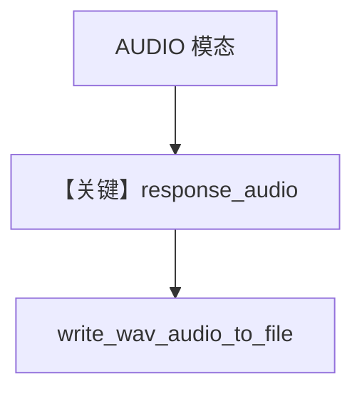

# text_to_speech.py — 实现原理分析

<!-- cookbook-py-source:start -->
## 完整源码

```python
"""
Google Text To Speech
=====================

Cookbook example for `google/gemini/text_to_speech.py`.
"""

from agno.agent import Agent
from agno.models.google import Gemini
from agno.utils.audio import write_wav_audio_to_file

# ---------------------------------------------------------------------------
# Create Agent
# ---------------------------------------------------------------------------

agent = Agent(
    model=Gemini(
        id="gemini-2.5-flash-preview-tts",
        response_modalities=["AUDIO"],
        speech_config={
            "voice_config": {"prebuilt_voice_config": {"voice_name": "Kore"}}
        },
    )
)

run_output = agent.run("Say cheerfully: Have a wonderful day!")

if run_output.response_audio is not None:
    audio_data = run_output.response_audio.content
    output_file = "tmp/cheerful_greeting.wav"
    write_wav_audio_to_file(output_file, audio_data)

# ---------------------------------------------------------------------------
# Run Agent
# ---------------------------------------------------------------------------

if __name__ == "__main__":
    pass
```

<!-- cookbook-py-source:end -->

> 源文件：`cookbook/90_models/google/gemini/text_to_speech.py`

## 概述

**TTS 模型**：`gemini-2.5-flash-preview-tts`，`response_modalities=["AUDIO"]`，`speech_config` 选音色，`run_output.response_audio` 写 WAV。

**核心配置一览：**

| 配置项 | 值 | 说明 |
|--------|------|------|
| `model` | `Gemini(id="gemini-2.5-flash-preview-tts", response_modalities=["AUDIO"], speech_config={...})` | |

## Mermaid 流程图



## 关键源码文件索引

| 文件 | 关键函数/类 | 作用 |
|------|------------|------|
| `agno/utils/audio.py` | `write_wav_audio_to_file` | |
| `agno/models/google/gemini.py` | 响应音频解析 | |
