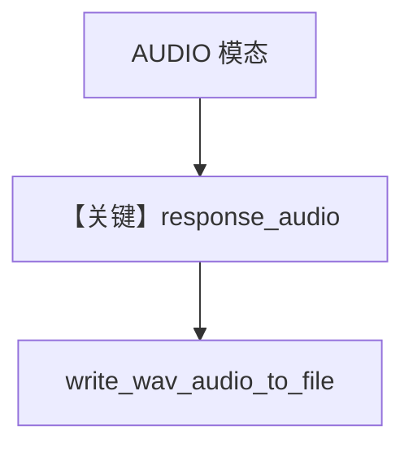

# text_to_speech.py — 实现原理分析

> 源文件：`cookbook/90_models/google/gemini/text_to_speech.py`

## 概述

**TTS 模型**：`gemini-2.5-flash-preview-tts`，`response_modalities=["AUDIO"]`，`speech_config` 选音色，`run_output.response_audio` 写 WAV。

**核心配置一览：**

| 配置项 | 值 | 说明 |
|--------|------|------|
| `model` | `Gemini(id="gemini-2.5-flash-preview-tts", response_modalities=["AUDIO"], speech_config={...})` | |

## Mermaid 流程图

## 关键源码文件索引

| 文件 | 关键函数/类 | 作用 |
|------|------------|------|
| `agno/utils/audio.py` | `write_wav_audio_to_file` | |
| `agno/models/google/gemini.py` | 响应音频解析 | |
