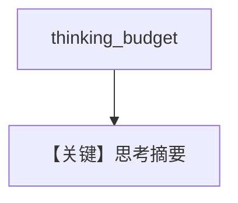

# thinking_agent.py — 实现原理分析

<!-- cookbook-py-source:start -->
## 完整源码

```python
"""
Google Thinking Agent
=====================

Cookbook example for `google/gemini/thinking_agent.py`.
"""

from agno.agent import Agent
from agno.models.google import Gemini

# ---------------------------------------------------------------------------
# Create Agent
# ---------------------------------------------------------------------------

task = (
    "Three missionaries and three cannibals need to cross a river. "
    "They have a boat that can carry up to two people at a time. "
    "If, at any time, the cannibals outnumber the missionaries on either side of the river, the cannibals will eat the missionaries. "
    "How can all six people get across the river safely? Provide a step-by-step solution and show the solutions as an ascii diagram"
)

agent = Agent(
    model=Gemini(
        id="gemini-2.5-pro",
        thinking_budget=1280,  # Enable thinking with token budget
        include_thoughts=True,  # Include thought summaries in response
    ),
    markdown=True,
)

# ---------------------------------------------------------------------------
# Run Agent
# ---------------------------------------------------------------------------
if __name__ == "__main__":
    # --- Sync ---
    agent.print_response(task)

    # --- Sync + Streaming ---
    agent.print_response(task, stream=True)
```

<!-- cookbook-py-source:end -->

> 源文件：`cookbook/90_models/google/gemini/thinking_agent.py`

## 概述

**`gemini-2.5-pro` + `thinking_budget=1280` + `include_thoughts=True`**，传教士过河题，同步与流式。

**核心配置一览：**

| 配置项 | 值 | 说明 |
|--------|------|------|
| `model` | `Gemini(id="gemini-2.5-pro", thinking_budget=1280, include_thoughts=True)` | |
| `markdown` | `True` | |

## Mermaid 流程图



## 关键源码文件索引

| 文件 | 关键函数/类 | 作用 |
|------|------------|------|
| `agno/models/google/gemini.py` | thinking 参数 | |
