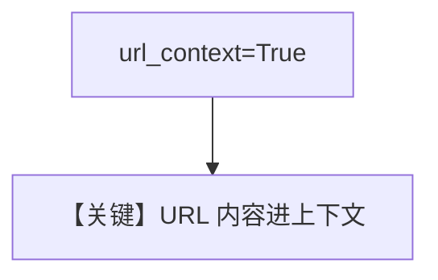

# url_context.py — 实现原理分析

<!-- cookbook-py-source:start -->
## 完整源码

```python
"""Run `uv pip install google-generativeai` to install dependencies."""

from agno.agent import Agent
from agno.models.google import Gemini

# ---------------------------------------------------------------------------
# Create Agent
# ---------------------------------------------------------------------------

agent = Agent(
    model=Gemini(id="gemini-2.5-flash", url_context=True),
    markdown=True,
)

url1 = "https://www.foodnetwork.com/recipes/ina-garten/perfect-roast-chicken-recipe-1940592"
url2 = "https://www.allrecipes.com/recipe/83557/juicy-roasted-chicken/"

# ---------------------------------------------------------------------------
# Run Agent
# ---------------------------------------------------------------------------
if __name__ == "__main__":
    # --- Sync ---
    agent.print_response(
        f"Compare the ingredients and cooking times from the recipes at {url1} and {url2}"
    )
```

<!-- cookbook-py-source:end -->

> 源文件：`cookbook/90_models/google/gemini/url_context.py`

## 概述

**`url_context=True`**：模型拉取并理解 URL 内容，对比两则菜谱 URL。

**核心配置一览：**

| 配置项 | 值 | 说明 |
|--------|------|------|
| `model` | `Gemini(id="gemini-2.5-flash", url_context=True)` | |
| `markdown` | `True` | |

## Mermaid 流程图



## 关键源码文件索引

| 文件 | 关键函数/类 | 作用 |
|------|------------|------|
| `agno/models/google/gemini.py` | `url_context` | |
