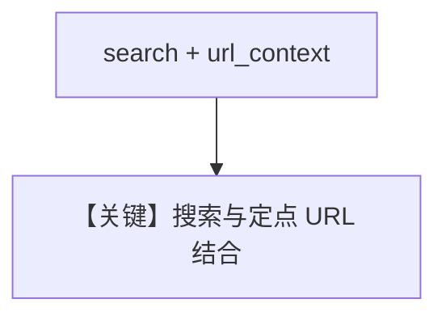

# url_context_with_search.py — 实现原理分析

<!-- cookbook-py-source:start -->
## 完整源码

```python
"""Combine URL context with Google Search for comprehensive web analysis.

Run `uv pip install google-generativeai` to install dependencies.
"""

from agno.agent import Agent
from agno.models.google import Gemini

# ---------------------------------------------------------------------------
# Create Agent
# ---------------------------------------------------------------------------

# Create agent with both Google Search and URL context enabled
agent = Agent(
    model=Gemini(id="gemini-2.5-flash", search=True, url_context=True),
    markdown=True,
)

# The agent will first search for relevant URLs, then analyze their content in detail
agent.print_response(
    "Analyze the content of the following URL: https://docs.agno.com/introduction and also give me latest updates on AI agents"
)

# ---------------------------------------------------------------------------
# Run Agent
# ---------------------------------------------------------------------------

if __name__ == "__main__":
    pass
```

<!-- cookbook-py-source:end -->

> 源文件：`cookbook/90_models/google/gemini/url_context_with_search.py`

## 概述

**同时 `search=True` 与 `url_context=True`**：先搜后读站或组合分析。

**核心配置一览：**

| 配置项 | 值 | 说明 |
|--------|------|------|
| `model` | `Gemini(id="gemini-2.5-flash", search=True, url_context=True)` | |
| `markdown` | `True` | |

## Mermaid 流程图



## 关键源码文件索引

| 文件 | 关键函数/类 | 作用 |
|------|------------|------|
| `agno/models/google/gemini.py` | `search` / `url_context` | |
