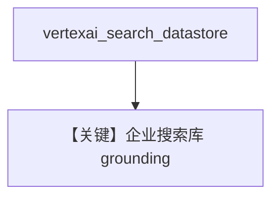

# vertex_ai_search.py — 实现原理分析

> 源文件：`cookbook/90_models/google/gemini/vertex_ai_search.py`

## 概述

**Vertex AI Search 数据存储 grounding**：`vertexai_search=True`，`vertexai_search_datastore` 为完整 datastore 资源名，`vertexai=True`。

**核心配置一览：**

| 配置项 | 值 | 说明 |
|--------|------|------|
| `model` | `Gemini(id="gemini-2.5-flash", vertexai_search=True, vertexai_search_datastore=..., vertexai=True)` | |

## Mermaid 流程图

## 关键源码文件索引

| 文件 | 关键函数/类 | 作用 |
|------|------------|------|
| `agno/models/google/gemini.py` | Vertex Search 字段 | |
