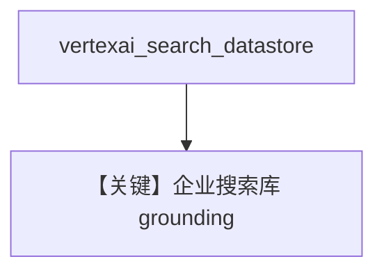

# vertex_ai_search.py — 实现原理分析

<!-- cookbook-py-source:start -->
## 完整源码

```python
"""Vertex AI Search with Gemini.

Vertex AI Search allows Gemini to search through your data stores,
providing grounded responses based on your private knowledge base.

Prerequisites:
1. Set up Vertex AI Search datastore in Google Cloud Console
2. Export environment variables:
   export GOOGLE_GENAI_USE_VERTEXAI="true"
   export GOOGLE_CLOUD_PROJECT="your-project-id"
   export GOOGLE_CLOUD_LOCATION="your-location"

Run `uv pip install google-generativeai` to install dependencies.
"""

from agno.agent import Agent
from agno.models.google import Gemini

# ---------------------------------------------------------------------------
# Create Agent
# ---------------------------------------------------------------------------

# Replace with your actual Vertex AI Search datastore ID
# Format: "projects/{project_id}/locations/{location}/collections/default_collection/dataStores/{datastore_id}"
datastore_id = "projects/your-project-id/locations/global/collections/default_collection/dataStores/your-datastore-id"

agent = Agent(
    model=Gemini(
        id="gemini-2.5-flash",
        vertexai_search=True,
        vertexai_search_datastore=datastore_id,
        vertexai=True,  # Use Vertex AI endpoint
    ),
    markdown=True,
)

# Ask questions that can be answered from your knowledge base
agent.print_response("What are our company's policies regarding remote work?")

# ---------------------------------------------------------------------------
# Run Agent
# ---------------------------------------------------------------------------

if __name__ == "__main__":
    pass
```

<!-- cookbook-py-source:end -->

> 源文件：`cookbook/90_models/google/gemini/vertex_ai_search.py`

## 概述

**Vertex AI Search 数据存储 grounding**：`vertexai_search=True`，`vertexai_search_datastore` 为完整 datastore 资源名，`vertexai=True`。

**核心配置一览：**

| 配置项 | 值 | 说明 |
|--------|------|------|
| `model` | `Gemini(id="gemini-2.5-flash", vertexai_search=True, vertexai_search_datastore=..., vertexai=True)` | |

## Mermaid 流程图



## 关键源码文件索引

| 文件 | 关键函数/类 | 作用 |
|------|------------|------|
| `agno/models/google/gemini.py` | Vertex Search 字段 | |
