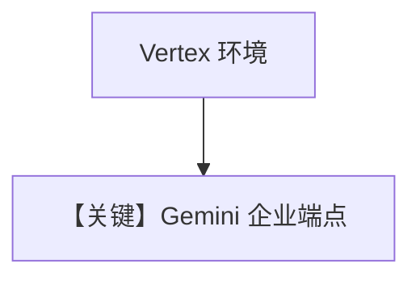

# vertexai.py — 实现原理分析

> 源文件：`cookbook/90_models/google/gemini/vertexai.py`

## 概述

**通过环境变量或 `vertexai=True` 使用 Vertex** 的说明性示例；代码中 **`Agent(model=Gemini(id="gemini-3-flash-preview"), markdown=True)`**，依赖 `GOOGLE_GENAI_USE_VERTEXAI` 等（见文件头）。

**核心配置一览：**

| 配置项 | 值 | 说明 |
|--------|------|------|
| `model` | `Gemini(id="gemini-3-flash-preview")` | 是否 Vertex 由 env/默认客户端决定 |

## Mermaid 流程图

## 关键源码文件索引

| 文件 | 关键函数/类 | 作用 |
|------|------------|------|
| `agno/models/google/gemini.py` | `get_client` | Vertex/API key 分流 |
