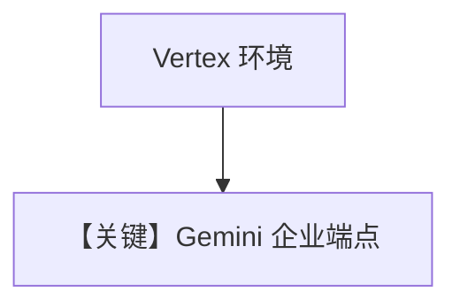

# vertexai.py — 实现原理分析

<!-- cookbook-py-source:start -->
## 完整源码

```python
"""
To use Vertex AI, with the Gemini Model class, you need to set the following environment variables:

export GOOGLE_GENAI_USE_VERTEXAI="true"
export GOOGLE_CLOUD_PROJECT="your-project-id"
export GOOGLE_CLOUD_LOCATION="your-location"

Or you can set the following parameters in the `Gemini` class:

gemini = Gemini(
    vertexai=True,
    project_id="your-google-cloud-project-id",
    location="your-google-cloud-location",
)
"""

from agno.agent import Agent, RunOutput  # noqa
from agno.models.google import Gemini

# ---------------------------------------------------------------------------
# Create Agent
# ---------------------------------------------------------------------------

agent = Agent(model=Gemini(id="gemini-3-flash-preview"), markdown=True)

# Get the response in a variable
# run: RunOutput = agent.run("Share a 2 sentence horror story")
# print(run.content)

# Print the response in the terminal
agent.print_response("Share a 2 sentence horror story")

# ---------------------------------------------------------------------------
# Run Agent
# ---------------------------------------------------------------------------

if __name__ == "__main__":
    pass
```

<!-- cookbook-py-source:end -->

> 源文件：`cookbook/90_models/google/gemini/vertexai.py`

## 概述

**通过环境变量或 `vertexai=True` 使用 Vertex** 的说明性示例；代码中 **`Agent(model=Gemini(id="gemini-3-flash-preview"), markdown=True)`**，依赖 `GOOGLE_GENAI_USE_VERTEXAI` 等（见文件头）。

**核心配置一览：**

| 配置项 | 值 | 说明 |
|--------|------|------|
| `model` | `Gemini(id="gemini-3-flash-preview")` | 是否 Vertex 由 env/默认客户端决定 |

## Mermaid 流程图



## 关键源码文件索引

| 文件 | 关键函数/类 | 作用 |
|------|------------|------|
| `agno/models/google/gemini.py` | `get_client` | Vertex/API key 分流 |
