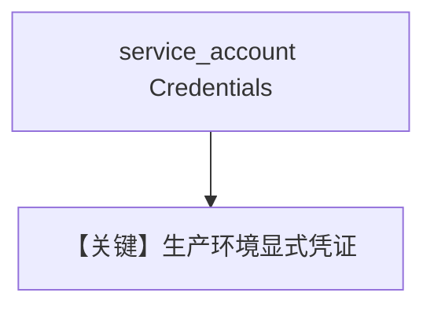

# vertexai_with_credentials.py — 实现原理分析

<!-- cookbook-py-source:start -->
## 完整源码

```python
"""
Google Vertexai With Credentials
================================

Cookbook example for `google/gemini/vertexai_with_credentials.py`.
"""

from agno.agent import Agent
from agno.models.google import Gemini

# ---------------------------------------------------------------------------
# Create Agent
# ---------------------------------------------------------------------------

# To use Vertex AI with explicit credentials, you can pass a
# google.oauth2.service_account.Credentials object to the Gemini class.

# 1. Load your service account credentials (example using a JSON file)
# from google.oauth2 import service_account
# credentials = service_account.Credentials.from_service_account_file('path/to/your/service-account.json')

# For demonstration, we'll assume credentials is provided
credentials = None  # Replace with your actual credentials object

# 2. Initialize the Gemini model with the credentials parameter
model = Gemini(
    id="gemini-3-flash-preview",
    vertexai=True,
    project_id="your-google-cloud-project-id",
    location="us-central1",
    credentials=credentials,
)

# 3. Create the Agent
agent = Agent(model=model, markdown=True)

# 4. Use the Agent
agent.print_response(
    "Explain how explicit credentials help in production environments."
)

# ---------------------------------------------------------------------------
# Run Agent
# ---------------------------------------------------------------------------

if __name__ == "__main__":
    pass
```

<!-- cookbook-py-source:end -->

> 源文件：`cookbook/90_models/google/gemini/vertexai_with_credentials.py`

## 概述

**显式传入 `credentials`**（示例为 `None` 占位），`vertexai=True`，`project_id` / `location` 指定。

**核心配置一览：**

| 配置项 | 值 | 说明 |
|--------|------|------|
| `model` | `Gemini(id="gemini-3-flash-preview", vertexai=True, project_id=..., location=..., credentials=credentials)` | |

## Mermaid 流程图



## 关键源码文件索引

| 文件 | 关键函数/类 | 作用 |
|------|------------|------|
| `agno/models/google/gemini.py` | `credentials` | |
