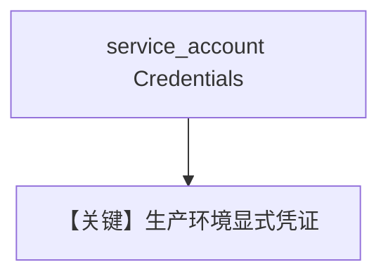

# vertexai_with_credentials.py — 实现原理分析

> 源文件：`cookbook/90_models/google/gemini/vertexai_with_credentials.py`

## 概述

**显式传入 `credentials`**（示例为 `None` 占位），`vertexai=True`，`project_id` / `location` 指定。

**核心配置一览：**

| 配置项 | 值 | 说明 |
|--------|------|------|
| `model` | `Gemini(id="gemini-3-flash-preview", vertexai=True, project_id=..., location=..., credentials=credentials)` | |

## Mermaid 流程图

## 关键源码文件索引

| 文件 | 关键函数/类 | 作用 |
|------|------------|------|
| `agno/models/google/gemini.py` | `credentials` | |
