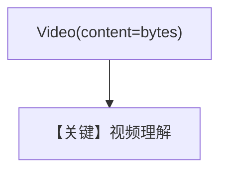

# video_input_bytes_content.py — 实现原理分析

<!-- cookbook-py-source:start -->
## 完整源码

```python
"""
Google Video Input Bytes Content
================================

Cookbook example for `google/gemini/video_input_bytes_content.py`.
"""

import requests
from agno.agent import Agent
from agno.media import Video
from agno.models.google import Gemini

# ---------------------------------------------------------------------------
# Create Agent
# ---------------------------------------------------------------------------

agent = Agent(
    model=Gemini(id="gemini-3-flash-preview"),
    markdown=True,
)

url = "https://videos.pexels.com/video-files/5752729/5752729-uhd_2560_1440_30fps.mp4"

# Download the video file from the URL as bytes
response = requests.get(url)
video_content = response.content

agent.print_response(
    "Tell me about this video",
    videos=[Video(content=video_content)],
)

# ---------------------------------------------------------------------------
# Run Agent
# ---------------------------------------------------------------------------

if __name__ == "__main__":
    pass
```

<!-- cookbook-py-source:end -->

> 源文件：`cookbook/90_models/google/gemini/video_input_bytes_content.py`

## 概述

**视频字节**：`requests` 下载 MP4，`Video(content=video_content)`，`gemini-3-flash-preview`。

**核心配置一览：**

| 配置项 | 值 | 说明 |
|--------|------|------|
| `model` | `Gemini(id="gemini-3-flash-preview")` | |
| `markdown` | `True` | |

## Mermaid 流程图



## 关键源码文件索引

| 文件 | 关键函数/类 | 作用 |
|------|------------|------|
| `agno/media/video.py` | `Video` | |
