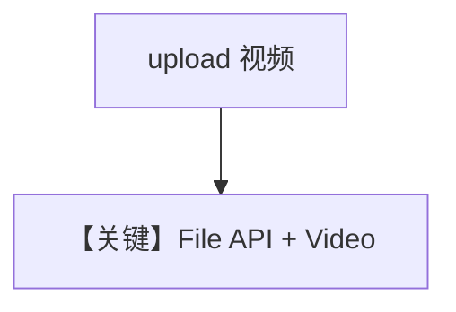

# video_input_file_upload.py — 实现原理分析

<!-- cookbook-py-source:start -->
## 完整源码

```python
"""
Google Video Input File Upload
==============================

Cookbook example for `google/gemini/video_input_file_upload.py`.
"""

import time
from pathlib import Path

from agno.agent import Agent
from agno.media import Video
from agno.models.google import Gemini
from agno.utils.log import logger
from google.genai.types import UploadFileConfig

# ---------------------------------------------------------------------------
# Create Agent
# ---------------------------------------------------------------------------

model = Gemini(id="gemini-3-flash-preview")
agent = Agent(
    model=model,
    markdown=True,
)

# Please download a sample video file to test this Agent
# Run: `wget https://storage.googleapis.com/generativeai-downloads/images/GreatRedSpot.mp4` to download a sample video
video_path = Path(__file__).parent.joinpath("GreatRedSpot.mp4")
video_file = None
remote_file_name = f"files/{video_path.stem.lower().replace('_', '')}"
try:
    video_file = model.get_client().files.get(name=remote_file_name)
except Exception as e:
    logger.info(f"Error getting file {video_path.stem}: {e}")
    pass

# Upload the video file if it doesn't exist
if not video_file:
    try:
        logger.info(f"Uploading video: {video_path}")
        video_file = model.get_client().files.upload(
            file=video_path,
            config=UploadFileConfig(name=video_path.stem, display_name=video_path.stem),
        )

        # Check whether the file is ready to be used.
        while video_file and video_file.state and video_file.state.name == "PROCESSING":
            time.sleep(2)
            if video_file and video_file.name:
                video_file = model.get_client().files.get(name=video_file.name)
            else:
                video_file = None

        logger.info(f"Uploaded video: {video_file}")
    except Exception as e:
        logger.error(f"Error uploading video: {e}")

# ---------------------------------------------------------------------------
# Run Agent
# ---------------------------------------------------------------------------

if __name__ == "__main__":
    agent.print_response(
        "Tell me about this video",
        videos=[Video(content=video_file)],
        stream=True,
    )
```

<!-- cookbook-py-source:end -->

> 源文件：`cookbook/90_models/google/gemini/video_input_file_upload.py`

## 概述

**大文件上传流程**：`files.upload` 等待 `PROCESSING`，`Video(content=video_file)`；`if __name__` 内 `print_response`。

**核心配置一览：**

| 配置项 | 值 | 说明 |
|--------|------|------|
| `model` | `Gemini(id="gemini-3-flash-preview")` | |

## Mermaid 流程图



## 关键源码文件索引

| 文件 | 关键函数/类 | 作用 |
|------|------------|------|
| `agno/models/google/gemini.py` | `get_client().files` | |
