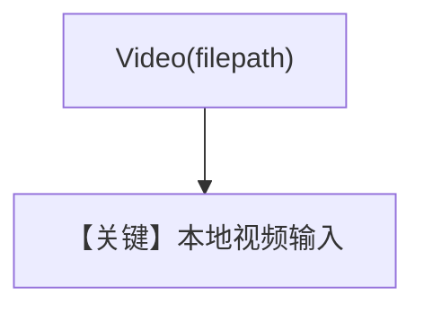

# video_input_local_file_upload.py — 实现原理分析

<!-- cookbook-py-source:start -->
## 完整源码

```python
"""
Google Video Input Local File Upload
====================================

Cookbook example for `google/gemini/video_input_local_file_upload.py`.
"""

from pathlib import Path

from agno.agent import Agent
from agno.media import Video
from agno.models.google import Gemini

# ---------------------------------------------------------------------------
# Create Agent
# ---------------------------------------------------------------------------

agent = Agent(
    model=Gemini(id="gemini-3-flash-preview"),
    markdown=True,
)

# Get sample videos from https://www.pexels.com/search/videos/sample/
video_path = Path(__file__).parent.joinpath("sample_video.mp4")

agent.print_response("Tell me about this video?", videos=[Video(filepath=video_path)])

# ---------------------------------------------------------------------------
# Run Agent
# ---------------------------------------------------------------------------

if __name__ == "__main__":
    pass
```

<!-- cookbook-py-source:end -->

> 源文件：`cookbook/90_models/google/gemini/video_input_local_file_upload.py`

## 概述

**本地路径**：`Video(filepath=video_path)`，`gemini-3-flash-preview`。

**核心配置一览：**

| 配置项 | 值 | 说明 |
|--------|------|------|
| `model` | `Gemini(id="gemini-3-flash-preview")` | |
| `markdown` | `True` | |

## Mermaid 流程图



## 关键源码文件索引

| 文件 | 关键函数/类 | 作用 |
|------|------------|------|
| `agno/media/video.py` | `Video` | |
