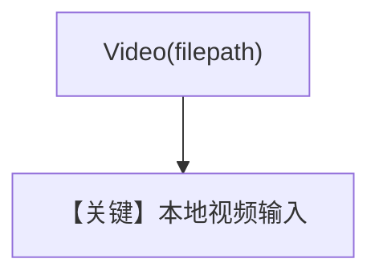

# video_input_local_file_upload.py — 实现原理分析

> 源文件：`cookbook/90_models/google/gemini/video_input_local_file_upload.py`

## 概述

**本地路径**：`Video(filepath=video_path)`，`gemini-3-flash-preview`。

**核心配置一览：**

| 配置项 | 值 | 说明 |
|--------|------|------|
| `model` | `Gemini(id="gemini-3-flash-preview")` | |
| `markdown` | `True` | |

## Mermaid 流程图

## 关键源码文件索引

| 文件 | 关键函数/类 | 作用 |
|------|------------|------|
| `agno/media/video.py` | `Video` | |
