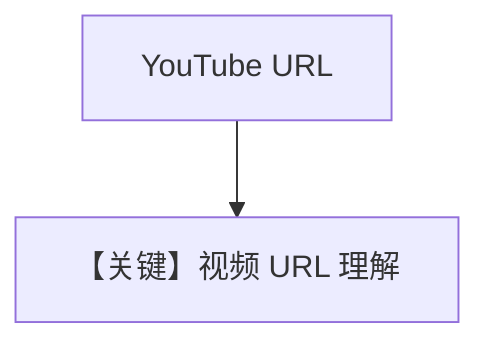

# video_input_youtube.py — 实现原理分析

<!-- cookbook-py-source:start -->
## 完整源码

```python
"""
Google Video Input Youtube
==========================

Cookbook example for `google/gemini/video_input_youtube.py`.
"""

from agno.agent import Agent
from agno.media import Video
from agno.models.google import Gemini

# ---------------------------------------------------------------------------
# Create Agent
# ---------------------------------------------------------------------------

agent = Agent(
    model=Gemini(id="gemini-3-flash-preview"),
    markdown=True,
)

agent.print_response(
    "Tell me about this video?",
    videos=[Video(url="https://www.youtube.com/watch?v=XinoY2LDdA0")],
)

# Video upload via URL is also supported with Vertex AI

# agent = Agent(
#     model=Gemini(id="gemini-3-flash-preview", vertexai=True),
#     markdown=True,
# )

# agent.print_response("Tell me about this video?", videos=[Video(url="https://www.youtube.com/watch?v=XinoY2LDdA0")])

# ---------------------------------------------------------------------------
# Run Agent
# ---------------------------------------------------------------------------

if __name__ == "__main__":
    pass
```

<!-- cookbook-py-source:end -->

> 源文件：`cookbook/90_models/google/gemini/video_input_youtube.py`

## 概述

**YouTube URL**：`Video(url="https://www.youtube.com/watch?v=...")`；注释给出 **Vertex** 变体示例。

**核心配置一览：**

| 配置项 | 值 | 说明 |
|--------|------|------|
| `model` | `Gemini(id="gemini-3-flash-preview")` | |
| `markdown` | `True` | |

## Mermaid 流程图



## 关键源码文件索引

| 文件 | 关键函数/类 | 作用 |
|------|------------|------|
| `agno/media/video.py` | `Video` url | |
