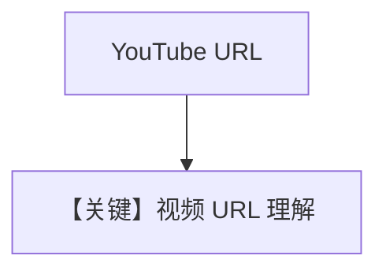

# video_input_youtube.py — 实现原理分析

> 源文件：`cookbook/90_models/google/gemini/video_input_youtube.py`

## 概述

**YouTube URL**：`Video(url="https://www.youtube.com/watch?v=...")`；注释给出 **Vertex** 变体示例。

**核心配置一览：**

| 配置项 | 值 | 说明 |
|--------|------|------|
| `model` | `Gemini(id="gemini-3-flash-preview")` | |
| `markdown` | `True` | |

## Mermaid 流程图

## 关键源码文件索引

| 文件 | 关键函数/类 | 作用 |
|------|------------|------|
| `agno/media/video.py` | `Video` url | |
