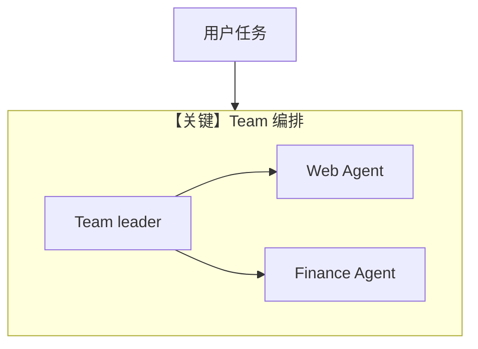

# agent_team.py — 实现原理分析

> 源文件：`cookbook/90_models/groq/agent_team.py`

## 概述

**Team**：两名 `Agent`（Web + Finance，`Groq`），`Team` 领导者同为 `Groq`，`instructions` 列表聚合，`show_members_responses=False`。

**核心配置一览：**

| 配置项 | 值 | 说明 |
|--------|------|------|
| `web_agent` / `finance_agent` | `Groq(id="llama-3.3-70b-versatile")` + 各自 tools | |
| `agent_team` | `Team(members=[...], model=Groq(...), instructions=[...], markdown=True, show_members_responses=False)` | |

## System Prompt 组装

**不适用单一 Agent 的 `get_system_message` 全量默认路径**：Team 与成员 Agent 各有指令；详见 `agno/team/` 中 Team 如何组装 leader/member 消息。

## 完整 API 请求

Leader 模型：`Groq` → `chat.completions.create`（`groq.py` L298）；成员被 Team 调度多次调用。

## Mermaid 流程图

## 关键源码文件索引

| 文件 | 关键函数/类 | 作用 |
|------|------------|------|
| `agno/team/team.py` | `Team` | 多 Agent |
| `agno/models/groq/groq.py` | `invoke()` L283+ | Groq API |
