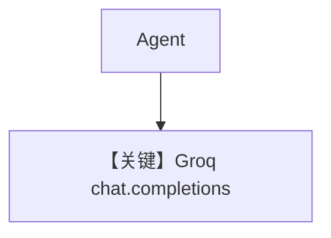

# basic.py — 实现原理分析

> 源文件：`cookbook/90_models/groq/basic.py`

## 概述

**Groq** 极速推理 API：`Groq(id="llama-3.3-70b-versatile")`，`chat.completions.create`（`groq.py`）。

**核心配置一览：**

| 配置项 | 值 | 说明 |
|--------|------|------|
| `model` | `Groq(id="llama-3.3-70b-versatile")` | 非 OpenAILike，独立 `Groq` 类 |
| `markdown` | `True` | |

## 完整 API 请求

```python
# libs/agno/agno/models/groq/groq.py L298-301
get_client().chat.completions.create(model=self.id, messages=[...], **get_request_params(...))
```

## Mermaid 流程图



## 关键源码文件索引

| 文件 | 关键函数/类 | 作用 |
|------|------------|------|
| `agno/models/groq/groq.py` | `Groq` | |
