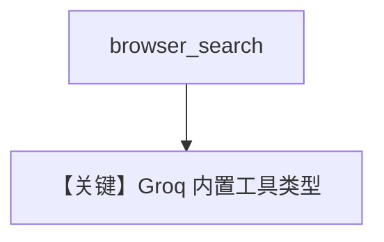

# browser_search.py — 实现原理分析

> 源文件：`cookbook/90_models/groq/browser_search.py`

## 概述

**Groq 原生浏览器搜索工具**：`tools=[{"type": "browser_search"}]`（非 `WebSearchTools`），`openai/gpt-oss-20b`。

**核心配置一览：**

| 配置项 | 值 | 说明 |
|--------|------|------|
| `model` | `Groq(id="openai/gpt-oss-20b")` | |
| `tools` | `[{"type": "browser_search"}]` | 提供商原生工具类型 |

## 运行机制与因果链

工具 schema 直接为 dict，由 `get_request_params` 传给 Groq。

## Mermaid 流程图

## 关键源码文件索引

| 文件 | 关键函数/类 | 作用 |
|------|------------|------|
| `agno/models/groq/groq.py` | `format_message` / tools | |
