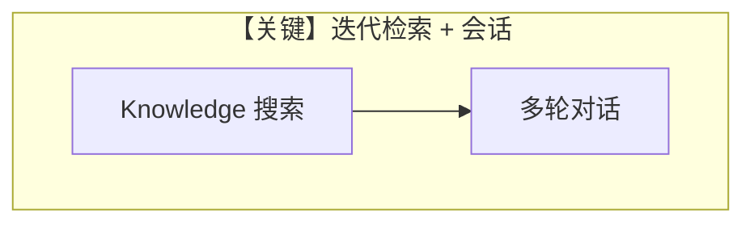

# deep_knowledge.py — 实现原理分析

> 源文件：`cookbook/90_models/groq/deep_knowledge.py`

## 概述

**交互式 DeepKnowledge**：`typer` + `inquirer`，`create_agent` 含长 `description`/`instructions`/`additional_context`（`dedent`），`Knowledge`（LanceDB + Agno 文档 URL），`SqliteDb`，`add_history_to_context=True`，`num_history_runs=3`，`read_chat_history=True`。

**核心配置一览：**

| 配置项 | 值 | 说明 |
|--------|------|------|
| `model` | `Groq(id="llama-3.3-70b-versatile")` | |
| `knowledge` | `agent_knowledge` | 向量检索 |
| `db` | `SqliteDb(db_file="tmp/agents.db")` | |

## System Prompt 组装

### 还原说明

`description`、`instructions`、`additional_context` 均为长字面量，须从源文件 **原样** 复制；此处不展开。

## Mermaid 流程图

## 关键源码文件索引

| 文件 | 关键函数/类 | 作用 |
|------|------------|------|
| `agno/knowledge/knowledge.py` | `Knowledge` | |
| `agno/models/groq/groq.py` | `Groq` | |
