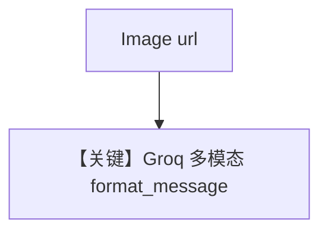

# image_agent.py — 实现原理分析

<!-- cookbook-py-source:start -->
## 完整源码

```python
"""
Groq Image Agent
================

Cookbook example for `groq/image_agent.py`.
"""

from agno.agent import Agent
from agno.media import Image
from agno.models.groq import Groq

# ---------------------------------------------------------------------------
# Create Agent
# ---------------------------------------------------------------------------

agent = Agent(model=Groq(id="meta-llama/llama-4-scout-17b-16e-instruct"))

agent.print_response(
    "Tell me about this image",
    images=[
        Image(url="https://upload.wikimedia.org/wikipedia/commons/f/f2/LPU-v1-die.jpg"),
    ],
    stream=True,
)

# ---------------------------------------------------------------------------
# Run Agent
# ---------------------------------------------------------------------------

if __name__ == "__main__":
    pass
```

<!-- cookbook-py-source:end -->

> 源文件：`cookbook/90_models/groq/image_agent.py`

## 概述

**Groq 视觉模型**：`meta-llama/llama-4-scout-17b-16e-instruct`，`Image(url=...)`，流式。

**核心配置一览：**

| 配置项 | 值 | 说明 |
|--------|------|------|
| `model` | `Groq(id="meta-llama/llama-4-scout-17b-16e-instruct")` | |
| `markdown` | 未设置 | 默认 `False` |

## Mermaid 流程图



## 关键源码文件索引

| 文件 | 关键函数/类 | 作用 |
|------|------------|------|
| `agno/models/groq/groq.py` | `format_message` | 图像警告/支持见源码 |
