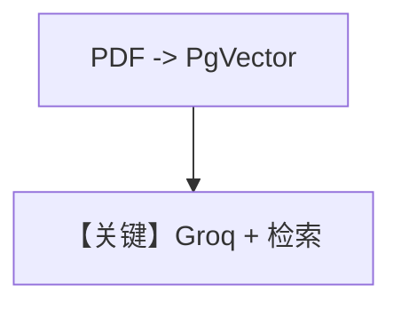

# knowledge.py — 实现原理分析

> 源文件：`cookbook/90_models/groq/knowledge.py`

## 概述

**PgVector + Knowledge（PDF URL）+ Groq**，`knowledge.insert` ThaiRecipes.pdf，`print_response(..., markdown=True)` 在调用时传入。

**核心配置一览：**

| 配置项 | 值 | 说明 |
|--------|------|------|
| `model` | `Groq(id="llama-3.3-70b-versatile")` | |
| `knowledge` | `Knowledge(vector_db=PgVector(...))` | 未显式 `search_knowledge=True` |

## Mermaid 流程图

## 关键源码文件索引

| 文件 | 关键函数/类 | 作用 |
|------|------------|------|
| `agno/vectordb/pgvector/` | `PgVector` | |
| `agno/models/groq/groq.py` | `invoke()` | |
