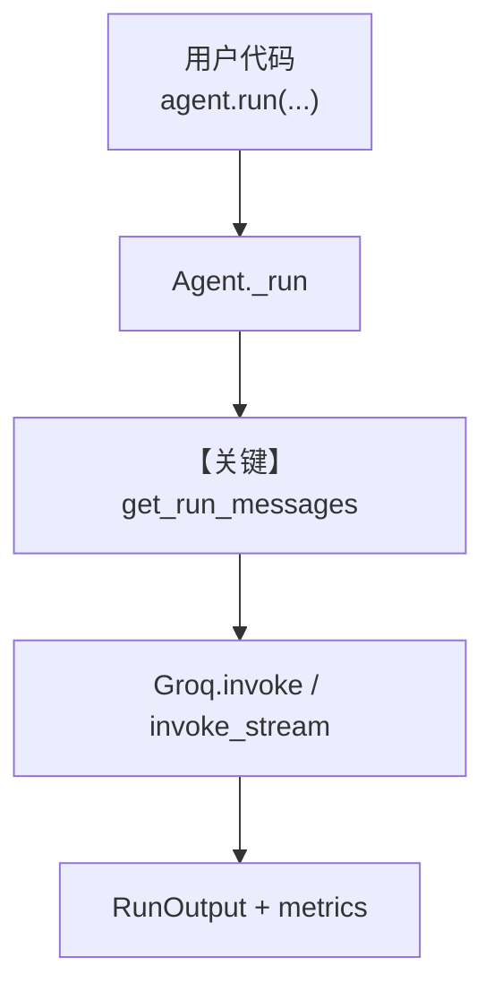

# metrics.py — 实现原理分析

<!-- cookbook-py-source:start -->
## 完整源码

```python
"""
Groq Metrics
============

Cookbook example for `groq/metrics.py`.
"""

from agno.agent import Agent, RunOutput
from agno.models.groq import Groq
from agno.tools.yfinance import YFinanceTools
from agno.utils.pprint import pprint_run_response
from rich.pretty import pprint

# ---------------------------------------------------------------------------
# Create Agent
# ---------------------------------------------------------------------------

agent = Agent(
    model=Groq(id="llama-3.3-70b-versatile"),
    tools=[YFinanceTools()],
    markdown=True,
)

run_output: RunOutput = agent.run("What is the stock price of NVDA")
pprint_run_response(run_output)

# Print metrics per message
if run_output.messages:
    for message in run_output.messages:  # type: ignore
        if message.role == "assistant":
            if message.content:
                print(f"Message: {message.content}")
            elif message.tool_calls:
                print(f"Tool calls: {message.tool_calls}")
            print("---" * 5, "Metrics", "---" * 5)
            pprint(message.metrics)
            print("---" * 20)

# Print the metrics
print("---" * 5, "Collected Metrics", "---" * 5)
pprint(run_output.metrics)  # type: ignore

# ---------------------------------------------------------------------------
# Run Agent
# ---------------------------------------------------------------------------

if __name__ == "__main__":
    pass
```

<!-- cookbook-py-source:end -->

> 源文件：`cookbook/90_models/groq/metrics.py`

## 概述

本示例展示 Agno 在 **Groq Chat Completions** 上跑带 **YFinance 工具** 的 Agent，并从 **`RunOutput` 与逐条 `Message`** 中读取 **token/耗时类指标**（含 Groq 扩展字段）。

**核心配置一览：**

| 配置项 | 值 | 说明 |
|--------|-----|------|
| `model` | `Groq(id="llama-3.3-70b-versatile")` | Groq Chat Completions API |
| `tools` | `[YFinanceTools()]` | 股价等金融数据工具 |
| `markdown` | `True` | 系统提示中追加 Markdown 格式说明（见 `_messages.py` 3.2.1） |

## 架构分层

```
用户代码层                agno.agent 层
┌──────────────────┐    ┌──────────────────────────────────┐
│ metrics.py       │    │ Agent.run() / _run()             │
│ agent.run(...)   │───>│  get_system_message()            │
│ pprint_run_response│   │  get_run_messages()             │
│                  │    │  model.response() → Groq.invoke   │
└──────────────────┘    └──────────────────────────────────┘
                                │
                                ▼
                        ┌──────────────┐
                        │ Groq          │
                        │ llama-3.3-70b │
                        └──────────────┘
```

## 核心组件解析

### Groq 与指标解析

`Groq.invoke()`（`agno/models/groq/groq.py` 约 L283–307）调用 `client.chat.completions.create`；用量写入 `ModelResponse.response_usage`，并经 `RunOutput` 聚合。流式场景下 chunk 可带 `x_groq.usage`（同文件 `_parse_provider_response_delta` 约 L538–540）。

### YFinance 工具循环

若模型返回 `tool_calls`，Agent 在运行循环中执行工具并把结果写回消息列表，再发起下一轮模型调用（见 `agent.model.response` 与工具处理链）。

### 运行机制与因果链

1. **数据路径**：用户字符串 → `get_run_messages()` 组消息 → `Groq.invoke(..., tools=...)` → 助手消息 + 可选工具往返 → `RunOutput.messages` 与 `run_output.metrics`。
2. **状态**：本示例未配置 `db`/`knowledge`；指标随 `RunOutput` 与 assistant `Message.metrics` 存在于内存。
3. **分支**：有工具调用时多轮；无则单次 completion。`message.content` 与 `message.tool_calls` 二选一展示（示例打印逻辑）。
4. **定位**：在 `90_models/groq` 中强调 **Metrics 可观测性**，而非模型路由本身。

## System Prompt 组装

| 序号 | 组成部分 | 本文件中的值/来源 | 是否生效 |
|------|---------|------------------|---------|
| 1 | `description` | 未设置 | 否 |
| 2 | `instructions` | 未设置 | 否 |
| 3 | `markdown` | `True` → 附加信息「Use markdown…」 | 是 |
| 4 | 知识库检索说明 | 默认 `search_knowledge=True` 且无 `knowledge` 时通常无检索段落；有则见 3.3.13 | 视默认 |
| 5 | 模型侧 system | `get_system_message_for_model` | 视模型 |

### 拼装顺序与源码锚点

默认路径：`get_system_message()`（`agno/agent/_messages.py` L106 起）按注释 **3.1** 指令列表（本例为空）→ **3.2.1** Markdown 附加段 → **3.3.x** 拼装正文 → **3.3.14** 模型补充 system。

### 还原后的完整 System 文本

本文件未设置 `description` / `instructions` / `system_message`，走 `get_system_message()` 默认拼装。静态可确定片段如下（另含模型 `get_system_message_for_model`、工具说明等运行时注入段，需运行时打印 `Message.content` 或调试 `get_system_message` 出口核对全文）。

```text
<additional_information>
- Use markdown to format your answers.
</additional_information>
```

本示例用户输入（用于对照一次 run）：`What is the stock price of NVDA`。

### 段落释义（模型视角）

- Markdown 段约束助手用 Markdown 排版，便于终端/`pprint` 阅读。
- 工具存在时，模型收到工具 schema 与调用约定（由工具与 Agent 组装）。

### 与 User 消息的边界

用户消息仅为询价句；系统侧承担格式与工具策略；Groq 使用 `messages[]` 中 `role=system`（或适配器映射）与用户内容。

## 完整 API 请求

```python
# Groq：OpenAI 兼容 Chat Completions（见 groq.py invoke）
groq_client.chat.completions.create(
    model="llama-3.3-70b-versatile",
    messages=[
        # {"role": "system", "content": "<见上一节还原>"},
        # {"role": "user", "content": "What is the stock price of NVDA"},
        # 若有工具往返，还包含 assistant tool_calls 与 tool 结果消息
    ],
    tools=[...],  # YFinance 工具 JSON schema
)
```

> 与「还原后的 System 文本」对应：`messages` 首条 system 来自 `get_system_message()`。

## Mermaid 流程图



- **【关键】get_run_messages**：决定传入 Groq 的完整对话与工具定义。

## 关键源码文件索引

| 文件 | 关键函数/类 | 作用 |
|------|------------|------|
| `agno/agent/_messages.py` | `get_system_message()` L106+ | 默认系统提示 |
| `agno/agent/_run.py` | `_run` / `_arun` | 推理前后与模型调用顺序 |
| `agno/models/groq/groq.py` | `invoke()` L283+、`invoke_stream()` L359+ | Groq HTTP 调用与 usage |
| `agno/run/agent.py` | `RunOutput` | 聚合 metrics / messages |
