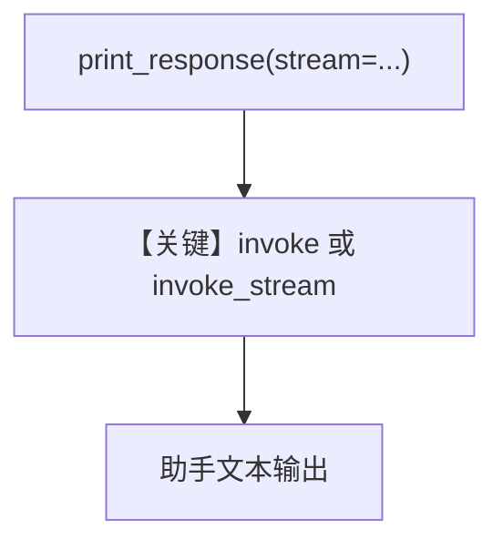

# basic.py — 实现原理分析

<!-- cookbook-py-source:start -->
## 完整源码

```python
"""
Groq Basic
==========

Cookbook example for `groq/reasoning/basic.py`.
"""

from agno.agent import Agent
from agno.models.groq import Groq

# ---------------------------------------------------------------------------
# Create Agent
# ---------------------------------------------------------------------------

agent = Agent(model=Groq(id="deepseek-r1-distill-llama-70b-specdec"), markdown=True)

# Print the response on the terminal

# ---------------------------------------------------------------------------
# Run Agent
# ---------------------------------------------------------------------------
if __name__ == "__main__":
    # --- Sync ---
    agent.print_response("Share a 2 sentence horror story")

    # --- Sync + Streaming ---
    agent.print_response("Share a 2 sentence horror story", stream=True)
```

<!-- cookbook-py-source:end -->

> 源文件：`cookbook/90_models/groq/reasoning/basic.py`

## 概述

本示例展示 Agno 通过 **`Groq` 模型** 调用 **Chat Completions**（同步/流式），演示同一 Agent 上 **`print_response` 的流式与非流式** 两种用法。

**核心配置一览：**

| 配置项 | 值 | 说明 |
|--------|-----|------|
| `model` | `Groq(id="deepseek-r1-distill-llama-70b-specdec")` | Groq Chat Completions |
| `markdown` | `True` | 系统提示附加 Markdown 指引 |

## 架构分层

```
用户代码层                agno.agent 层
┌──────────────────┐    ┌──────────────────────────────────┐
│ basic.py         │    │ Agent.print_response / _run       │
│ stream True/False│───>│  get_system_message()             │
│                  │    │  Groq.invoke 或 invoke_stream     │
└──────────────────┘    └──────────────────────────────────┘
                                │
                                ▼
                        ┌──────────────┐
                        │ Groq API     │
                        └──────────────┘
```

## 核心组件解析

### Groq Chat Completions

`Groq.invoke` / `invoke_stream`（`agno/models/groq/groq.py` 约 L283、L359）向 `chat.completions.create` 发送 `messages`。

### 运行机制与因果链

1. **路径**：用户提示 → `get_run_messages()` → Groq → 助手文本（流式则逐 chunk）。
2. **状态**：无 `db`/知识库；单次会话内存。
3. **分支**：`stream=True` 走 `invoke_stream`；否则 `invoke`。
4. **定位**：`reasoning/` 下最简 **模型 smoke test**，对比同目录推理/工具示例。

## System Prompt 组装

| 序号 | 组成部分 | 本文件 | 是否生效 |
|------|---------|--------|---------|
| 1 | `markdown` | `True` | 是 |

### 拼装顺序与源码锚点

`get_system_message()`（`agno/agent/_messages.py` L106+）中 **3.2.1** 在 `output_schema is None` 时追加 Markdown 指引；**3.3.14** 可能追加模型侧 system。

### 还原后的完整 System 文本

```text
<additional_information>
- Use markdown to format your answers.
</additional_information>
```

文档中选取的用户消息：`Share a 2 sentence horror story`（与 `if __name__` 中第一次 `print_response` 一致）。

### 段落释义（模型视角）

- Markdown 段要求输出适合终端展示的格式。

### 与 User 消息边界

用户消息仅为故事请求；无 `description`/`instructions`。

## 完整 API 请求

```python
# groq.Groq → chat.completions.create（非流式）
client.chat.completions.create(
    model="deepseek-r1-distill-llama-70b-specdec",
    messages=[
        # system: 见上节
        # user: "Share a 2 sentence horror story"
    ],
)
# 流式：stream=True
```

## Mermaid 流程图



## 关键源码文件索引

| 文件 | 关键 | 作用 |
|------|------|------|
| `agno/models/groq/groq.py` | `invoke` / `invoke_stream` L283+ | HTTP 调用 |
| `agno/agent/_messages.py` | `get_system_message` L106+ | 系统提示 |
