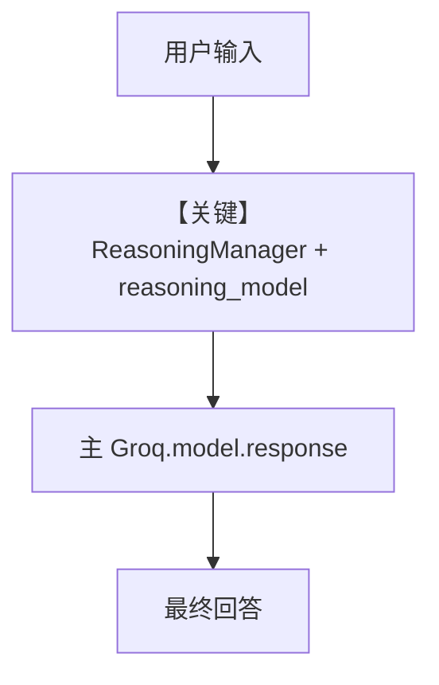

# demo_deepseek_qwen.py — 实现原理分析

> 源文件：`cookbook/90_models/groq/reasoning/demo_deepseek_qwen.py`

## 概述

本示例展示 Agno 的 **`reasoning=True` + 独立 `reasoning_model`**：主模型 `Qwen-2.5-32b` 生成最终回答，推理用 `Deepseek-r1-distill-qwen-32b`（温度、token 等单独配置）。

**核心配置一览：**

| 配置项 | 值 | 说明 |
|--------|-----|------|
| `model` | `Groq(id="Qwen-2.5-32b")` | 主答模型 |
| `reasoning` | `True` | 开启推理管线 |
| `reasoning_model` | `Groq(id="Deepseek-r1-distill-qwen-32b", temperature=0.6, max_tokens=1024, top_p=0.95)` | 推理专用 Groq 模型 |

## 架构分层

```
用户代码层                agno.agent + reasoning
┌──────────────────┐    ┌──────────────────────────────────┐
│ Agent(...,       │    │ handle_reasoning / ReasoningManager│
│  reasoning=True) │───>│ reason()（_response.py L249+）     │
│ print_response   │    │ 然后 model.response() 主模型       │
└──────────────────┘    └──────────────────────────────────┘
```

## 核心组件解析

### ReasoningManager

`reason()`（`agno/agent/_response.py` 约 L249–293）构造 `ReasoningManager`，用 `reasoning_model` 对同一 `run_messages` 做推理，再进入主模型生成。

### 运行机制与因果链

1. **路径**：用户问题 → 推理模型（Groq）→ 推理结果进入上下文/事件 → 主模型 Groq 生成最终回复。
2. **状态**：无持久化存储；推理与主调用各计 metrics（视实现）。
3. **分支**：`reasoning=False` 时不经 `ReasoningManager`。
4. **定位**：演示 **双 Groq 模型分工**，区别于仅设 `reasoning_model` 的示例。

## System Prompt 组装

本文件 **未** 在 `Agent(...)` 中设置 `markdown=True`（`markdown=True` 仅在 `print_response` 参数，不改变 `agent.markdown` 属性）。默认系统提示以框架默认为主；若需确认是否含 Markdown 附加段，请查 `Agent.markdown` 默认值（`False`）及运行时 `get_system_message()` 出口。

### 还原后的完整 System 文本

无法仅从本文件静态还原完整 system（取决于默认 Agent 开关及 `get_system_message_for_model`）。验证方式：在 `get_system_message()` 返回前打印 `Message.content`，或对单次 `run` 断点查看。

用户消息（示例）：`9.11 and 9.9 -- which is bigger?`

## 完整 API 请求

至少涉及 **两次** Groq Chat Completions 类调用：其一服务 `reasoning_model`，其二服务主 `model`（具体参数由 `ReasoningManager` 与 `Groq` 组装）。

```python
# 概念结构：两次 chat.completions.create，model id 不同
# 1) reasoning_model: Deepseek-r1-distill-qwen-32b + temperature/max_tokens/top_p
# 2) model: Qwen-2.5-32b
```

## Mermaid 流程图



## 关键源码文件索引

| 文件 | 关键 | 作用 |
|------|------|------|
| `agno/agent/_response.py` | `reason()` L249+ | 推理入口 |
| `agno/reasoning/manager.py` | `ReasoningManager` | 推理多步 |
| `agno/models/groq/groq.py` | `invoke` | Groq 请求 |
