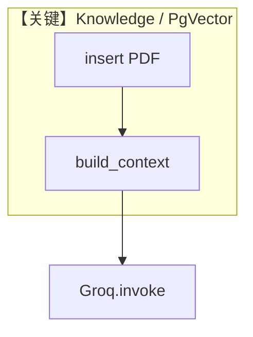

# demo_qwen_2_5_32B.py — 实现原理分析

> 源文件：`cookbook/90_models/groq/reasoning/demo_qwen_2_5_32B.py`

## 概述

本示例展示 **`Knowledge`（PgVector）+ `Groq`**：先向量化写入 PDF，再由 Agent **`search_knowledge` 默认 True** 在系统提示中注入检索指引，回答「泰式咖喱」类问题。

**核心配置一览：**

| 配置项 | 值 | 说明 |
|--------|-----|------|
| `model` | `Groq(id="Qwen-2.5-32b")` | Groq Chat Completions |
| `knowledge` | `Knowledge(vector_db=PgVector(...))` | RAG |

## 架构分层

```
用户代码层                agno.agent 层
┌──────────────────┐    ┌──────────────────────────────────┐
│ knowledge.insert │    │ get_system_message() 3.3.13       │
│ Agent(knowledge=)│───>│ Knowledge.build_context → 检索说明 │
│ print_response   │    │ Groq.invoke                       │
└──────────────────┘    └──────────────────────────────────┘
```

## 核心组件解析

### 知识库上下文

`_messages.py` **3.3.13**：若 `search_knowledge` 且 `add_search_knowledge_instructions`，调用 `Knowledge.build_context(...)` 追加检索说明（具体正文依赖向量库状态与 PDF 分块，**不可静态伪造**）。

### 运行机制与因果链

1. **路径**：`insert(url=...)` 写入 PG → 用户问句 → 检索上下文进 system → Groq 生成。
2. **状态**：PostgreSQL + pgvector 持久化；会话取决于是否配置 `db`（本例未配）。
3. **分支**：无知识时与「有知识」行为差异在 `build_context` 输出。
4. **定位**：同目录 **RAG + Groq** 演示，对比纯对话 `basic.py`。

## System Prompt 组装

| 序号 | 组成部分 | 本文件 | 是否生效 |
|------|---------|--------|---------|
| 1 | 知识检索说明 | `Knowledge.build_context` 动态 | 是（若启用指令） |

### 还原后的完整 System 文本

知识库相关正文随 **已入库内容、检索结果** 变化，无法从 `.py` 单独还原。验证：运行前确保 PG 可连、`insert` 成功；在 `build_context` 或 `get_system_message` 返回处打印。

用户消息：`How to make Thai curry?`（`markdown=True` 为 `print_response` 参数）。

## 完整 API 请求

```python
# Groq chat.completions.create
# messages[0].content 含动态知识段 + 用户问题
```

## Mermaid 流程图



## 关键源码文件索引

| 文件 | 关键 | 作用 |
|------|------|------|
| `agno/agent/_messages.py` | 3.3.13 L409+ | 知识段注入 |
| `agno/knowledge/knowledge.py` | `build_context` | 检索上下文 |
| `agno/models/groq/groq.py` | `invoke` | 调用 Groq |
