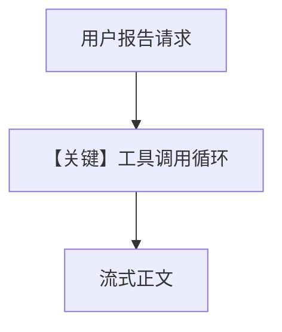

# finance_agent.py — 实现原理分析

<!-- cookbook-py-source:start -->
## 完整源码

```python
"""
Groq Finance Agent
==================

Cookbook example for `groq/reasoning/finance_agent.py`.
"""

from agno.agent import Agent
from agno.models.groq import Groq
from agno.tools.yfinance import YFinanceTools

# ---------------------------------------------------------------------------
# Create Agent
# ---------------------------------------------------------------------------

# Create an Agent with Groq and YFinanceTools
finance_agent = Agent(
    model=Groq(id="deepseek-r1-distill-llama-70b-specdec"),
    tools=[YFinanceTools()],
    description="You are an investment analyst with deep expertise in market analysis",
    instructions=[
        "Use tables to display data where possible.",
        "Always call the tool before you answer.",
    ],
    add_datetime_to_context=True,
    markdown=True,
)

# Example usage
finance_agent.print_response(
    "Write a report on NVDA with stock price, analyst recommendations, and stock fundamentals.",
    stream=True,
)

# ---------------------------------------------------------------------------
# Run Agent
# ---------------------------------------------------------------------------

if __name__ == "__main__":
    pass
```

<!-- cookbook-py-source:end -->

> 源文件：`cookbook/90_models/groq/reasoning/finance_agent.py`

## 概述

本示例展示 **Groq + YFinance 工具** 的投资分析 Agent，带 **`description`、列表 `instructions`、`add_datetime_to_context`** 与 **流式输出**。

**核心配置一览：**

| 配置项 | 值 | 说明 |
|--------|-----|------|
| `model` | `Groq(id="deepseek-r1-distill-llama-70b-specdec")` | Groq |
| `tools` | `[YFinanceTools()]` | 金融数据 |
| `description` | 投资分析师（见下） | 角色 |
| `instructions` | 表格展示、先工具后答 | 行为约束 |
| `add_datetime_to_context` | `True` | 当前时间 |
| `markdown` | `True` | Markdown |

## 架构分层

```
finance_agent.print_response(..., stream=True)
        │
        ▼
get_system_message() → 工具 schema → Groq.invoke_stream
```

## 核心组件解析

### 工具优先策略

`instructions` 要求「Always call the tool before you answer」，驱动多轮：先 `tool_calls`，再总结报告。

### 运行机制与因果链

1. **路径**：用户主题 → 可能多轮工具 → 流式文本。
2. **状态**：无 `db`；时间来自 `add_datetime_to_context`。
3. **分支**：模型是否先调用工具取决于生成结果。
4. **定位**：`reasoning/` 下 **金融垂直** 示例，较 `tool_use.py` 多了 description/时间。

## System Prompt 组装

### 还原后的完整 System 文本（静态字面量原样）

```text
You are an investment analyst with deep expertise in market analysis

- Use tables to display data where possible.
- Always call the tool before you answer.

<additional_information>
- Use markdown to format your answers.
- The current time is <运行时 datetime.now() 的字符串>.
</additional_information>
```

（另含 YFinance 工具说明等，由框架追加。）

用户消息（示例）：`Write a report on NVDA with stock price, analyst recommendations, and stock fundamentals.`

## 完整 API 请求

```python
client.chat.completions.create(
    model="deepseek-r1-distill-llama-70b-specdec",
    messages=[...],
    tools=[...],
    stream=True,
)
```

## Mermaid 流程图



## 关键源码文件索引

| 文件 | 关键 | 作用 |
|------|------|------|
| `agno/agent/_messages.py` | L234-261、L187-207 | description、instructions、时间 |
| `agno/models/groq/groq.py` | `invoke_stream` | 流式 |
