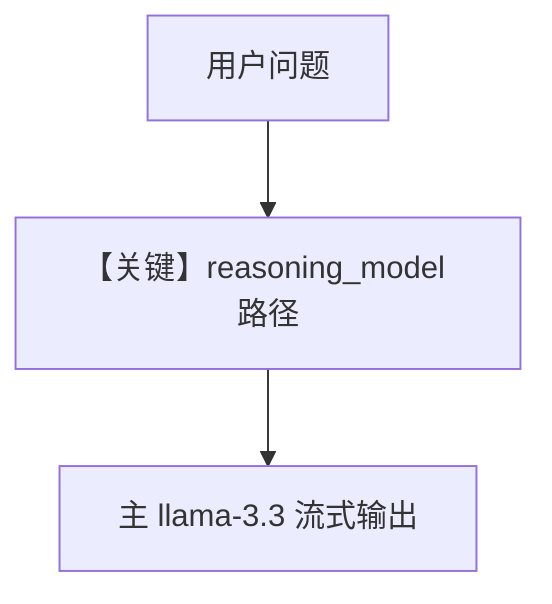

# reasoning_agent.py — 实现原理分析

> 源文件：`cookbook/90_models/groq/reasoning_agent.py`

## 概述

本示例展示 **主模型 `llama-3.3-70b-versatile` + 专用 `reasoning_model`（DeepSeek 蒸馏）** 的推理管线，**未** 显式设置 `reasoning=True`（是否仍走推理取决于框架对「仅设 reasoning_model」的默认行为，以运行时为准）。

**核心配置一览：**

| 配置项 | 值 | 说明 |
|--------|-----|------|
| `model` | `Groq(id="llama-3.3-70b-versatile")` | 主生成 |
| `reasoning_model` | `Groq(id="deepseek-r1-distill-llama-70b", temperature=0.6, max_tokens=1024, top_p=0.95)` | 推理 |

## 架构分层

```
reasoning_agent.print_response(..., stream=True)
        │
        ▼
ReasoningManager（若启用）→ Groq 主模型流式
```

## 核心组件解析

### 运行机制与因果链

1. **路径**：比较数值类问题 → 推理模型参与链式推理（若启用）→ 主模型输出。
2. **状态**：无持久化。
3. **分支**：与 `reasoning=True` 的 demo 对比：本文件只设 `reasoning_model`，未设 `reasoning` 布尔。
4. **定位**：**双 Groq** 能力展示，位于 `groq/` 根目录。

## System Prompt 组装

未设置 `markdown`/`description`/`instructions`；默认 system 以框架与模型附加为准。验证：`get_system_message()` 出口。

### 还原后的完整 System 文本

无法仅从本文件列出全部字面量。若需完整正文，在 `agno/agent/_messages.py` `get_system_message` 返回前打印。

用户消息：`Is 9.11 bigger or 9.9?`

## 完整 API 请求

涉及 `Groq` 的 `chat.completions.create`；若推理阶段启用，则至少两次模型调用（id 不同）。

## Mermaid 流程图



## 关键源码文件索引

| 文件 | 关键 |
|------|------|
| `agno/agent/_response.py` | `reason` L249+ |
| `agno/models/groq/groq.py` | `invoke_stream` |
