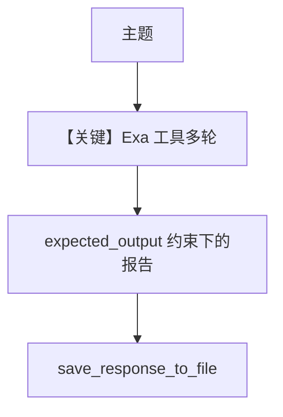

# research_agent_exa.py — 实现原理分析

<!-- cookbook-py-source:start -->
## 完整源码

```python
"""Run `uv pip install groq exa-py` to install dependencies."""

from datetime import datetime
from pathlib import Path
from textwrap import dedent

from agno.agent import Agent
from agno.models.groq import Groq
from agno.tools.exa import ExaTools

# ---------------------------------------------------------------------------
# Create Agent
# ---------------------------------------------------------------------------

cwd = Path(__file__).parent.resolve()
tmp = cwd.joinpath("tmp")
if not tmp.exists():
    tmp.mkdir(exist_ok=True, parents=True)

today = datetime.now().strftime("%Y-%m-%d")

agent = Agent(
    model=Groq(id="llama-3.3-70b-versatile"),
    tools=[ExaTools(start_published_date=today, type="keyword")],
    description="You are an advanced AI researcher writing a report on a topic.",
    instructions=[
        "For the provided topic, run 3 different searches.",
        "Read the results carefully and prepare a NYT worthy report.",
        "Focus on facts and make sure to provide references.",
    ],
    expected_output=dedent("""\
    An engaging, informative, and well-structured report in markdown format:

    ## Engaging Report Title

    ### Overview
    {give a brief introduction of the report and why the user should read this report}
    {make this section engaging and create a hook for the reader}

    ### Section 1
    {break the report into sections}
    {provide details/facts/processes in this section}

    ... more sections as necessary...

    ### Takeaways
    {provide key takeaways from the article}

    ### References
    - [Reference 1](link)
    - [Reference 2](link)
    - [Reference 3](link)

    ### About the Author
    {write a made up for yourself, give yourself a cyberpunk name and a title}

    - published on {date} in dd/mm/yyyy
    """),
    markdown=True,
    add_datetime_to_context=True,
    save_response_to_file=str(tmp.joinpath("{message}.md")),
)
agent.print_response("Llama 3.3 running on Groq", stream=True)

# ---------------------------------------------------------------------------
# Run Agent
# ---------------------------------------------------------------------------

if __name__ == "__main__":
    pass
```

<!-- cookbook-py-source:end -->

> 源文件：`cookbook/90_models/groq/research_agent_exa.py`

## 概述

本示例展示 **Groq + ExaTools 搜索**、长 **`expected_output` 模板**（dedent）、**`add_datetime_to_context`** 与 **`save_response_to_file`**，流式生成长文报告。

**核心配置一览：**

| 配置项 | 值 | 说明 |
|--------|-----|------|
| `model` | `Groq(id="llama-3.3-70b-versatile")` | Groq |
| `tools` | `ExaTools(start_published_date=today, type="keyword")` | Exa 检索 |
| `description` | 见源码 | 研究员角色 |
| `instructions` | 3 条搜索与写作要求 | 列表 |
| `expected_output` | dedent 多行 markdown 模板 | 输出结构 |
| `markdown` | `True` | Markdown |
| `add_datetime_to_context` | `True` | 时间 |
| `save_response_to_file` | `tmp/{message}.md` | 落盘 |

## 核心组件解析

### expected_output

`_messages.py` **3.3.7**：`expected_output` 原样包在 `<expected_output>...</expected_output>`。

### 运行机制与因果链

1. **路径**：用户主题 → Exa 多次检索 → 长文 Markdown → 可选写入 `tmp/`。
2. **状态**：写本地文件；无 DB。
3. **分支**：搜索失败时模型仍可能基于已有结果写作。
4. **定位**：与 `research_agent_seltz.py` 对照（Exa vs Seltz）。

## System Prompt 组装

### 还原后的完整 System 文本（用户字面量原样）

`description`：

```text
You are an advanced AI researcher writing a report on a topic.
```

`instructions`（列表拼接，默认无前导 `-` 时多条为每行 `- ...`，此处按源码顺序）：

```text
- For the provided topic, run 3 different searches.
- Read the results carefully and prepare a NYT worthy report.
- Focus on facts and make sure to provide references.
```

`expected_output`（dedent 后全文，须与 `.py` 一致）：

```text
An engaging, informative, and well-structured report in markdown format:

## Engaging Report Title

### Overview
{give a brief introduction of the report and why the user should read this report}
{make this section engaging and create a hook for the reader}

### Section 1
{break the report into sections}
{provide details/facts/processes in this section}

... more sections as necessary...

### Takeaways
{provide key takeaways from the article}

### References
- [Reference 1](link)
- [Reference 2](link)
- [Reference 3](link)

### About the Author
{write a made up for yourself, give yourself a cyberpunk name and a title}

- published on {date} in dd/mm/yyyy
```

（另含 `<additional_information>` 中 Markdown、当前时间；以及工具说明。）

用户消息：`Llama 3.3 running on Groq`

## 完整 API 请求

`Groq.chat.completions.create` + `tools`（Exa）；`stream=True`。

## Mermaid 流程图



## 关键源码文件索引

| 文件 | 关键 |
|------|------|
| `agno/agent/_messages.py` | L275-277 expected_output |
| `agno/tools/exa/` | ExaTools |
