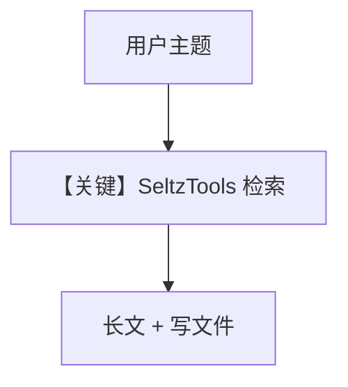

# research_agent_seltz.py — 实现原理分析

<!-- cookbook-py-source:start -->
## 完整源码

```python
"""Run `pip install groq seltz agno` to install dependencies."""

from pathlib import Path
from textwrap import dedent

from agno.agent import Agent
from agno.models.groq import Groq
from agno.tools.seltz import SeltzTools

# ---------------------------------------------------------------------------
# Create Agent
# ---------------------------------------------------------------------------

cwd = Path(__file__).parent.resolve()
tmp = cwd.joinpath("tmp")
if not tmp.exists():
    tmp.mkdir(exist_ok=True, parents=True)

agent = Agent(
    model=Groq(id="llama-3.3-70b-versatile"),
    tools=[SeltzTools(max_documents=10, show_results=True)],
    description="You are an advanced AI researcher writing a report on a topic.",
    instructions=[
        "For the provided topic, run 3 different searches.",
        "Read the results carefully and prepare a report.",
        "Focus on facts and make sure to provide references.",
    ],
    expected_output=dedent(
        """\
        An engaging, informative, and well-structured report in markdown format:

        ## Engaging Report Title

        ### Overview
        {give a brief introduction of the report and why the user should read this report}
        {make this section engaging and create a hook for the reader}

        ### Section 1
        {break the report into sections}
        {provide details/facts/processes in this section}

        ... more sections as necessary...

        ### Takeaways
        {provide key takeaways from the article}

        ### References
        - [Reference 1](link)
        - [Reference 2](link)
        - [Reference 3](link)

        ### About the Author
        {write a made up for yourself, give yourself a cyberpunk name and a title}

        - published on {date} in dd/mm/yyyy
        """
    ),
    markdown=True,
    add_datetime_to_context=True,
    save_response_to_file=str(tmp.joinpath("{message}.md")),
)
agent.print_response("Recent advances in AI safety", stream=True)

# ---------------------------------------------------------------------------
# Run Agent
# ---------------------------------------------------------------------------

if __name__ == "__main__":
    pass
```

<!-- cookbook-py-source:end -->

> 源文件：`cookbook/90_models/groq/research_agent_seltz.py`

## 概述

与 `research_agent_exa.py` 结构相同，工具换为 **`SeltzTools(max_documents=10, show_results=True)`**，演示 **Groq + Seltz** 检索写报告。

**核心配置一览：**

| 配置项 | 值 | 说明 |
|--------|-----|------|
| `model` | `Groq(id="llama-3.3-70b-versatile")` | Groq |
| `tools` | `SeltzTools(max_documents=10, show_results=True)` | Seltz |
| `description` | 见源码 | 研究员 |
| `instructions` | 3 条 | 搜索与引用 |
| `expected_output` | dedent 模板（与 Exa 版结构一致，指令略异） | 结构约束 |
| `markdown` | `True` | Markdown |
| `add_datetime_to_context` | `True` | 时间 |
| `save_response_to_file` | `tmp/{message}.md` | 落盘 |

## 核心组件解析

### 与 Exa 版差异

仅 **工具实现与 `instructions` 文案** 不同（Seltz 版为「prepare a report」而非「NYT worthy」）。

## System Prompt 组装

### 还原后的完整 System 文本（expected_output 原样）

```text
An engaging, informative, and well-structured report in markdown format:

## Engaging Report Title

### Overview
{give a brief introduction of the report and why the user should read this report}
{make this section engaging and create a hook for the reader}

### Section 1
{break the report into sections}
{provide details/facts/processes in this section}

... more sections as necessary...

### Takeaways
{provide key takeaways from the article}

### References
- [Reference 1](link)
- [Reference 2](link)
- [Reference 3](link)

### About the Author
{write a made up for yourself, give yourself a cyberpunk name and a title}

- published on {date} in dd/mm/yyyy
```

`description`：

```text
You are an advanced AI researcher writing a report on a topic.
```

`instructions`：

```text
- For the provided topic, run 3 different searches.
- Read the results carefully and prepare a report.
- Focus on facts and make sure to provide references.
```

用户消息：`Recent advances in AI safety`

## 完整 API 请求

Groq `chat.completions.create`，带 Seltz 工具 schema，`stream=True`。

## Mermaid 流程图



## 关键源码文件索引

| 文件 | 关键 |
|------|------|
| `agno/tools/seltz/` | SeltzTools |
| `agno/agent/_messages.py` | expected_output 段 |
