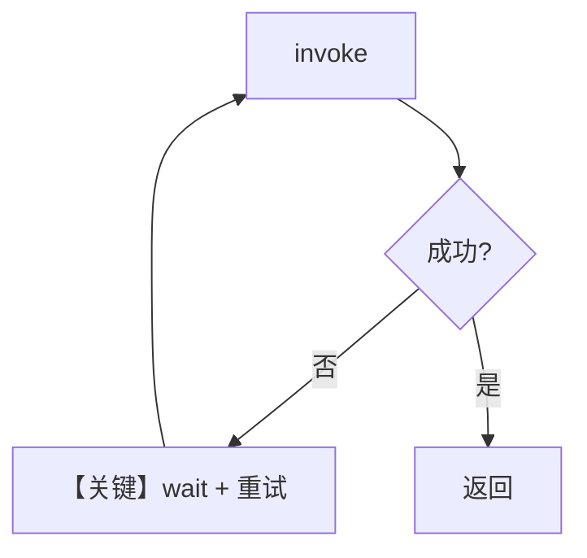

# retry.py — 实现原理分析

> 源文件：`cookbook/90_models/groq/retry.py`

## 概述

本示例展示在 **`Groq` 模型实例上配置 `retries` / `delay_between_retries` / `exponential_backoff`**，用 **错误模型 id** 触发失败与重试（用于验证韧性逻辑）。

**核心配置一览：**

| 配置项 | 值 | 说明 |
|--------|-----|------|
| `model` | `Groq(id="groq-wrong-id", retries=3, delay_between_retries=1, exponential_backoff=True)` | 故意失败 |
| 其他 Agent 参数 | 未显式设置 | 默认 |

## 核心组件解析

### 重试

重试参数在 **Model** 层消费（与具体 Provider 的 `invoke` 包装配合），失败时按间隔重试直至次数用尽。

### 运行机制与因果链

1. **路径**：用户问题 → Groq 请求失败 → 重试循环 → 仍失败则抛错（或最后一次错误）。
2. **状态**：无副持久化。
3. **分支**：`retries=0` 时首次失败即退出。
4. **定位**：`90_models/*/retry.py` 系列中的 **Groq** 变体。

## System Prompt 组装

无自定义 description；默认 system 仅框架默认段。还原验证同前。

用户消息：`What is the capital of France?`

## 完整 API 请求

底层仍为 `chat.completions.create`；错误模型 id 导致 4xx/业务错误，触发重试逻辑。

## Mermaid 流程图

## 关键源码文件索引

| 文件 | 关键 |
|------|------|
| `agno/models/base.py` / `groq` | 重试与错误封装 |
| `agno/models/groq/groq.py` | `invoke` |
