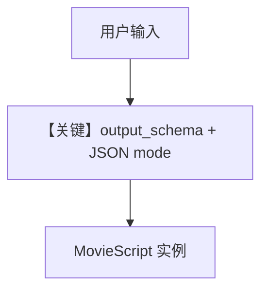

# structured_output.py — 实现原理分析

> 源文件：`cookbook/90_models/groq/structured_output.py`

## 概述

本示例展示 **`output_schema=MovieScript` + `use_json_mode=True`**：通过 Groq 的 JSON 输出约束，经 Agent 解析为 **Pydantic 模型实例**（`run.content`）。

**核心配置一览：**

| 配置项 | 值 | 说明 |
|--------|-----|------|
| `model` | `Groq(id="llama-3.3-70b-versatile")` | Groq |
| `description` | `You help people write movie scripts.` | 角色 |
| `output_schema` | `MovieScript` | 结构化输出 |
| `use_json_mode` | `True` | JSON 模式 |

## 核心组件解析

### Groq format_message 与 JSON

`Groq.format_message`（`groq.py` 约 L255–263）在 system 消息且 `response_format.type == json_object` 时追加：`Your output should be in JSON format.`

### 运行机制与因果链

1. **路径**：用户城市名 → 模型输出 JSON → 解析为 `MovieScript`。
2. **状态**：无 DB。
3. **分支**：若 `use_json_mode=False` 且模型支持原生 structured，可走不同路径。
4. **定位**：Groq 上 **结构化输出** 最小示例。

## System Prompt 组装

### 还原后的完整 System 文本（字面量）

```text
You help people write movie scripts.

```

（随后框架追加 JSON schema / `get_json_output_prompt` 等，见 `_messages.py` 3.3.15。）

用户消息：`New York`

## 完整 API 请求

```python
client.chat.completions.create(
    model="llama-3.3-70b-versatile",
    messages=[...],
    response_format={"type": "json_object"},  # 由 Agent 与 Groq 适配器组装
)
```

## Mermaid 流程图



## 关键源码文件索引

| 文件 | 关键 |
|------|------|
| `agno/agent/_messages.py` | 3.3.15 JSON prompt |
| `agno/models/groq/groq.py` | `format_message` JSON 后缀 |
| `agno/utils/prompts.py` | `get_json_output_prompt` |
