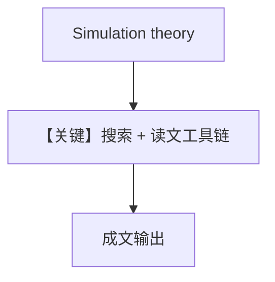

# tool_use.py — 实现原理分析

> 源文件：`cookbook/90_models/groq/tool_use.py`

## 概述

本示例展示 **Groq + WebSearchTools + Newspaper4kTools** 的多工具研究流，**同步/异步流式** 均演示。

**核心配置一览：**

| 配置项 | 值 | 说明 |
|--------|-----|------|
| `model` | `Groq(id="llama-3.3-70b-versatile")` | Groq |
| `tools` | `[WebSearchTools(), Newspaper4kTools()]` | 搜索 + 正文抽取 |
| `description` | senior NYT researcher | 角色 |
| `instructions` | 3 条 | 搜索、阅读、成文 |
| `markdown` | `True` | Markdown |
| `add_datetime_to_context` | `True` | 时间 |

## 核心组件解析

多工具顺序由模型决定：先搜链接再 `newspaper4k` 读文。

## System Prompt 组装

### 还原后的完整 System 文本（字面量）

`description`：

```text
You are a senior NYT researcher writing an article on a topic.
```

`instructions`：

```text
- For a given topic, search for the top 5 links.
- Then read each URL and extract the article text, if a URL isn't available, ignore it.
- Analyse and prepare an NYT worthy article based on the information.
```

（另含 `<additional_information>`：Markdown + 当前时间；工具说明。）

用户消息（`if __name__`）：`Simulation theory`

## 完整 API 请求

`chat.completions.create` + `tools` 数组；流式用 `stream=True`。

## Mermaid 流程图



## 关键源码文件索引

| 文件 | 关键 |
|------|------|
| `agno/agent/_tools.py` | 工具 schema |
| `agno/models/groq/groq.py` | `invoke` / `invoke_stream` |
