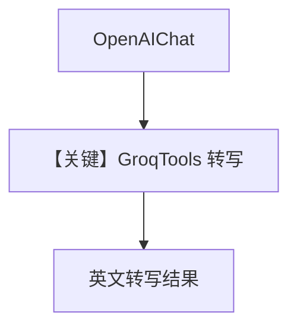

# transcription_agent.py — 实现原理分析

> 源文件：`cookbook/90_models/groq/transcription_agent.py`

## 概述

本示例展示 **主对话模型为 `OpenAIChat(gpt-5.2)`**，通过 **`GroqTools`**（`agno.tools.models.groq`）调用 **Groq 语音/转写能力**，而非 `agno.models.groq.Groq` 作为 LLM。即：**Chat 模型 + Groq 工具** 组合。

**核心配置一览：**

| 配置项 | 值 | 说明 |
|--------|-----|------|
| `name` | `"Groq Transcription Agent"` | Agent 名 |
| `model` | `OpenAIChat(id="gpt-5.2")` | OpenAI Chat Completions / 新 API 视适配器而定 |
| `tools` | `GroqTools(exclude_tools=["generate_speech"])` | 转写等 Groq API 封装 |

## 架构分层

```
Agent(OpenAIChat) → 规划自然语言 → GroqTools → Groq 服务端转写
```

## 核心组件解析

### 非 Groq Model

不存在 `Groq(...)` 作为 `model`；**System Prompt 仍由 `get_system_message()`** 为 **OpenAIChat** 路径组装，工具说明来自 `GroqTools`。

### 运行机制与因果链

1. **路径**：用户给出音频 URL → 模型选择 Groq 工具 → 返回转写文本。
2. **状态**：无示例级 DB。
3. **分支**：`exclude_tools` 限制可用工具集合。
4. **定位**：**Groq 目录下展示「工具型 Groq」**，与 `Groq` 模型类示例区分。

## System Prompt 组装

无自定义 `description`/`instructions`；完整 system 由默认 Agent 提示 + 工具文档构成。转写提示词可能出现在 **user** 消息中（用户请求转写）。

### 还原后的完整 System 文本

无法静态列出全部（依赖 OpenAI 适配器默认与 GroqTools 注入）。验证：`get_system_message()` 与首条 user 消息一并打印。

用户消息字面量：

```text
Please transcribe the audio file located at 'https://agno-public.s3.amazonaws.com/demo_data/sample_conversation.wav' to English
```

## 完整 API 请求

主循环调用 **OpenAI** 侧 `chat.completions` 或 Responses（以 `OpenAIChat` 实现为准）；工具执行时内部请求 Groq。

```python
# 概念：messages 含 system/user；tools 含 Groq 封装；模型 id gpt-5.2
```

## Mermaid 流程图



## 关键源码文件索引

| 文件 | 关键 |
|------|------|
| `agno/tools/models/groq.py` | GroqTools |
| `agno/models/openai/` | OpenAIChat invoke |
