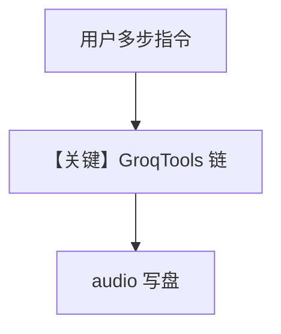

# translation_agent.py — 实现原理分析

<!-- cookbook-py-source:start -->
## 完整源码

```python
"""
Groq Translation Agent
======================

Cookbook example for `groq/translation_agent.py`.
"""

import base64
from pathlib import Path

from agno.agent import Agent
from agno.models.openai import OpenAIChat
from agno.tools.models.groq import GroqTools
from agno.utils.media import save_base64_data

# ---------------------------------------------------------------------------
# Create Agent
# ---------------------------------------------------------------------------

path = "tmp/sample-fr.mp3"

agent = Agent(
    name="Groq Translation Agent",
    model=OpenAIChat(id="gpt-5.2"),
    tools=[GroqTools()],
    cache_session=True,
)

response = agent.run(
    f"Let's transcribe the audio file located at '{path}' and translate it to English. After that generate a new music audio file using the translated text."
)

if response and response.audio:
    base64_audio = base64.b64encode(response.audio[0].content).decode("utf-8")
    save_base64_data(base64_audio, Path("tmp/sample-en.mp3"))  # type: ignore

# ---------------------------------------------------------------------------
# Run Agent
# ---------------------------------------------------------------------------

if __name__ == "__main__":
    pass
```

<!-- cookbook-py-source:end -->

> 源文件：`cookbook/90_models/groq/translation_agent.py`

## 概述

与 `transcription_agent` 类似：**`OpenAIChat` + `GroqTools` 全量**（未排除 `generate_speech`），演示 **转写 → 翻译 → 语音生成** 链；并启用 **`cache_session=True`**，将音频以 base64 落盘。

**核心配置一览：**

| 配置项 | 值 | 说明 |
|--------|-----|------|
| `name` | `"Groq Translation Agent"` | 名称 |
| `model` | `OpenAIChat(id="gpt-5.2")` | 主模型 |
| `tools` | `GroqTools()` | 全套 Groq 媒体工具 |
| `cache_session` | `True` | 会话缓存 |

## 核心组件解析

### 响应中的 audio

`response.audio` 存在时写入 `tmp/sample-en.mp3`，说明工具链返回 **音频字节**。

### 运行机制与因果链

1. **路径**：用户一句多步指令 → 模型多次工具 → 文本 + 音频。
2. **状态**：`cache_session` 影响会话缓存行为；文件写入本地。
3. **定位**：**翻译 + TTS** 端到端，较转写-only 更复杂。

## System Prompt 组装

无显式 `instructions`/`description`。用户消息为唯一固定字面量（见下）。

### 还原后的完整 User 消息（原样）

```text
Let's transcribe the audio file located at 'tmp/sample-fr.mp3' and translate it to English. After that generate a new music audio file using the translated text.
```

## 完整 API 请求

OpenAI 主对话 + Groq 工具侧调用（转写/合成）。

## Mermaid 流程图



## 关键源码文件索引

| 文件 | 关键 |
|------|------|
| `agno/tools/models/groq.py` | GroqTools |
| `agno/agent/agent.py` | `cache_session` |
