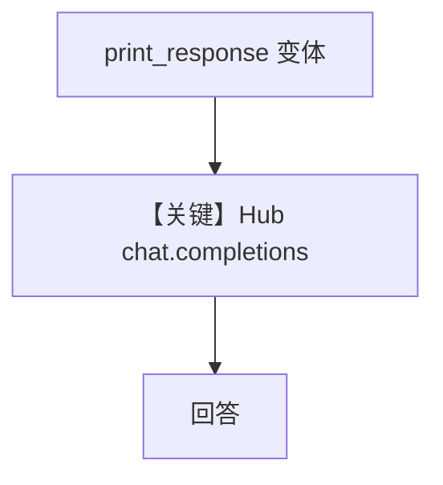

# basic.py — 实现原理分析

<!-- cookbook-py-source:start -->
## 完整源码

```python
"""
Huggingface Basic
=================

Cookbook example for `huggingface/basic.py`.
"""

import asyncio

from agno.agent import Agent
from agno.models.huggingface import HuggingFace

# ---------------------------------------------------------------------------
# Create Agent
# ---------------------------------------------------------------------------

agent = Agent(
    model=HuggingFace(
        id="mistralai/Mistral-7B-Instruct-v0.2", max_tokens=4096, temperature=0
    ),
)

# ---------------------------------------------------------------------------
# Run Agent
# ---------------------------------------------------------------------------
if __name__ == "__main__":
    # --- Sync ---
    agent.print_response(
        "What is meaning of life and then recommend 5 best books to read about it"
    )

    # --- Sync + Streaming ---
    agent.print_response(
        "What is meaning of life and then recommend 5 best books to read about it",
        stream=True,
    )

    # --- Async ---
    asyncio.run(
        agent.aprint_response(
            "What is meaning of life and then recommend 5 best books to read about it"
        )
    )

    # --- Async + Streaming ---
    asyncio.run(
        agent.aprint_response(
            "What is meaning of life and then recommend 5 best books to read about it",
            stream=True,
        )
    )
```

<!-- cookbook-py-source:end -->

> 源文件：`cookbook/90_models/huggingface/basic.py`

## 概述

本示例展示 **`HuggingFace` Inference Hub**（`huggingface_hub` 客户端）**Chat Completions** 路径，覆盖 **同步 / 同步流式 / 异步 / 异步流式** 四种 `print_response` / `aprint_response` 用法。

**核心配置一览：**

| 配置项 | 值 | 说明 |
|--------|-----|------|
| `model` | `HuggingFace(id="mistralai/Mistral-7B-Instruct-v0.2", max_tokens=4096, temperature=0)` | Hub 推理 |

## 架构分层

```
basic.py → Agent.print_response / aprint_response
         → HuggingFace.invoke / invoke_stream / ainvoke / ainvoke_stream
         → InferenceClient.chat.completions.create
```

## 核心组件解析

`HuggingFace.invoke`（`agno/models/huggingface/huggingface.py` 约 L238–257）调用 `get_client().chat.completions.create`。

### 运行机制与因果链

1. **路径**：用户哲学问题 → Hub 返回文本。
2. **状态**：无持久化。
3. **分支**：四类调用差异仅在同步与 stream。
4. **定位**：HuggingFace 适配器 **入口级** 示例。

## System Prompt 组装

未设 `markdown`/`description`。默认 system 无 Markdown 附加段（`agent.markdown` 默认 False）。静态可还原部分极少；验证 `get_system_message()`。

用户消息：`What is meaning of life and then recommend 5 best books to read about it`

## 完整 API 请求

```python
# huggingface.py L253
InferenceClient(...).chat.completions.create(
    model="mistralai/Mistral-7B-Instruct-v0.2",
    messages=[...],
    max_tokens=4096,
    temperature=0,
)
```

## Mermaid 流程图



## 关键源码文件索引

| 文件 | 关键 |
|------|------|
| `agno/models/huggingface/huggingface.py` | `invoke` L238+ |
