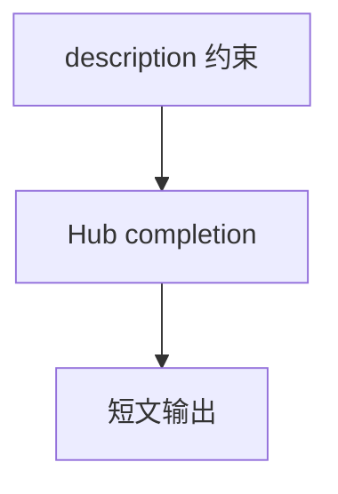

# llama_essay_writer.py — 实现原理分析

<!-- cookbook-py-source:start -->
## 完整源码

```python
"""
Huggingface Llama Essay Writer
==============================

Cookbook example for `huggingface/llama_essay_writer.py`.
"""

from agno.agent import Agent
from agno.models.huggingface import HuggingFace

# ---------------------------------------------------------------------------
# Create Agent
# ---------------------------------------------------------------------------

agent = Agent(
    model=HuggingFace(
        id="openai/gpt-oss-120b",
        max_tokens=4096,
    ),
    description="You are an essay writer. Write a 300 words essay on topic that will be provided by user",
)
agent.print_response("topic: AI")

# ---------------------------------------------------------------------------
# Run Agent
# ---------------------------------------------------------------------------

if __name__ == "__main__":
    pass
```

<!-- cookbook-py-source:end -->

> 源文件：`cookbook/90_models/huggingface/llama_essay_writer.py`

## 概述

本示例展示 **`HuggingFace` + `description`** 驱动短文写作（约 300 词），模型 `openai/gpt-oss-120b`。

**核心配置一览：**

| 配置项 | 值 | 说明 |
|--------|-----|------|
| `model` | `HuggingFace(id="openai/gpt-oss-120b", max_tokens=4096)` | Hub |
| `description` | `You are an essay writer. Write a 300 words essay on topic that will be provided by user` | 角色与长度 |

## System Prompt 组装

### 还原后的完整 System 文本（description 原样）

```text
You are an essay writer. Write a 300 words essay on topic that will be provided by user
```

用户消息：`topic: AI`

## 完整 API 请求

`InferenceClient.chat.completions.create`，`model="openai/gpt-oss-120b"`。

## Mermaid 流程图



## 关键源码文件索引

| 文件 | 关键 |
|------|------|
| `agno/agent/_messages.py` | 3.3.1 description |
| `agno/models/huggingface/huggingface.py` | `invoke` |
