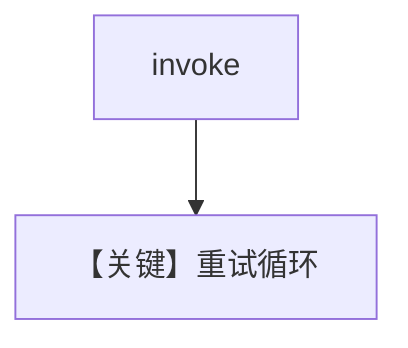

# retry.py — 实现原理分析

> 源文件：`cookbook/90_models/huggingface/retry.py`

## 概述

本示例用 **错误 `HuggingFace` 模型 id** 验证 **`retries` / `delay_between_retries` / `exponential_backoff`**。

**核心配置一览：**

| 配置项 | 值 | 说明 |
|--------|-----|------|
| `model` | `HuggingFace(id="huggingface-wrong-id", retries=3, delay_between_retries=1, exponential_backoff=True)` | 故意失败 |

## 核心组件解析

失败时由 Model 层重试；`InferenceTimeoutError` 等映射为 `ModelProviderError`（`huggingface.py`）。

## System Prompt 组装

无自定义；用户消息：`What is the capital of France?`

## 完整 API 请求

Hub `chat.completions.create` 反复失败直至重试耗尽。

## Mermaid 流程图

## 关键源码文件索引

| 文件 | 关键 |
|------|------|
| `agno/models/huggingface/huggingface.py` | `invoke`、异常处理 |
