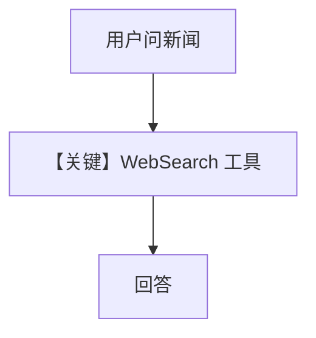

# tool_use.py — 实现原理分析

> 源文件：`cookbook/90_models/huggingface/tool_use.py`

## 概述

本示例展示 **`HuggingFace` + WebSearchTools** 做新闻检索，同步与流式。

**核心配置一览：**

| 配置项 | 值 | 说明 |
|--------|-----|------|
| `model` | `HuggingFace(id="openai/gpt-oss-120b")` | Hub |
| `tools` | `[WebSearchTools()]` | 搜索 |
| `markdown` | `True` | Markdown 附加段 |

## System Prompt 组装

### 还原后的完整 System 文本（静态段）

```text
<additional_information>
- Use markdown to format your answers.
</additional_information>
```

（另含工具说明。）

用户消息：`What is the latest news on AI?`

## 完整 API 请求

`chat.completions.create` + `tools`；Hub 需支持所声明工具协议。

## Mermaid 流程图



## 关键源码文件索引

| 文件 | 关键 |
|------|------|
| `agno/models/huggingface/huggingface.py` | `get_request_params` tools |
