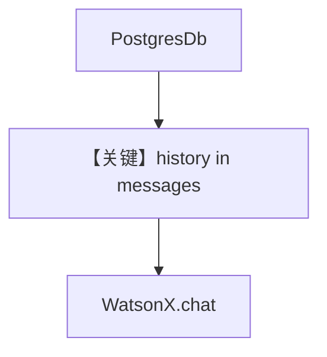

# db.md — 实现原理分析

<!-- cookbook-py-source:start -->
## 完整源码

```python
"""Run `uv pip install ddgs sqlalchemy ibm-watsonx-ai` to install dependencies."""

from agno.agent import Agent
from agno.db.postgres import PostgresDb
from agno.models.ibm import WatsonX
from agno.tools.websearch import WebSearchTools

# ---------------------------------------------------------------------------
# Create Agent
# ---------------------------------------------------------------------------

# Setup the database
db_url = "postgresql+psycopg://ai:ai@localhost:5532/ai"
db = PostgresDb(db_url=db_url)

agent = Agent(
    model=WatsonX(id="mistralai/mistral-small-3-1-24b-instruct-2503"),
    db=db,
    tools=[WebSearchTools()],
    add_history_to_context=True,
)
agent.print_response("How many people live in Canada?")
agent.print_response("What is their national anthem called?")

# ---------------------------------------------------------------------------
# Run Agent
# ---------------------------------------------------------------------------

if __name__ == "__main__":
    pass
```

<!-- cookbook-py-source:end -->

> 源文件：`cookbook/90_models/ibm/watsonx/db.py`

## 概述

本示例展示 **`PostgresDb` + `add_history_to_context=True` + WebSearchTools**，两轮对话依赖会话历史。

**核心配置一览：**

| 配置项 | 值 | 说明 |
|--------|-----|------|
| `model` | `WatsonX(id="mistralai/mistral-small-3-1-24b-instruct-2503")` | WatsonX |
| `db` | `PostgresDb(db_url=...)` | 会话持久化 |
| `tools` | `[WebSearchTools()]` | 搜索 |
| `add_history_to_context` | `True` | 历史进上下文 |

## 运行机制与因果链

1. **路径**：第一轮问答 → 写入会话 → 第二轮带历史再问。
2. **状态**：PostgreSQL 存会话；需本地 PG（`postgresql+psycopg://ai:ai@localhost:5532/ai`）。

## System Prompt 组装

含 Markdown 段 + 工具说明；历史消息在 `get_run_messages` 中追加为用户/助手轮次（见 `get_run_messages` 实现）。

用户消息：`How many people live in Canada?` 与 `What is their national anthem called?`

## 完整 API 请求

`WatsonX` `client.chat` + `messages` 含历史。

## Mermaid 流程图



## 关键源码文件索引

| 文件 | 关键 |
|------|------|
| `agno/db/postgres.py` | PostgresDb |
| `agno/agent/_messages.py` | `get_run_messages` |
