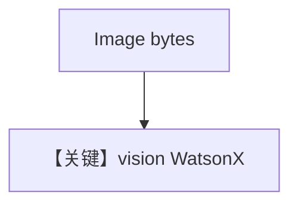

# image_agent_bytes.md — 实现原理分析

> 源文件：`cookbook/90_models/ibm/watsonx/image_agent_bytes.py`

## 概述

本示例展示 **`WatsonX` 视觉模型** + **`Image(content=bytes)`** 与流式输出。

**核心配置一览：**

| 配置项 | 值 | 说明 |
|--------|-----|------|
| `model` | `WatsonX(id="meta-llama/llama-3-2-11b-vision-instruct")` | 视觉 |
| `markdown` | `True` | Markdown |

## 核心组件解析

多模态消息由 Agent 组装进 `messages`；`WatsonX._format_message` 将图像传入 Watson 侧格式。

## System Prompt 组装

Markdown 附加段；无自定义 description。

用户消息：`Tell me about this image and and give me the latest news about it.`

## 完整 API 请求

`client.chat(messages=[...含图像...])`，具体字段以 IBM SDK 与 `watsonx.py` 为准。

## Mermaid 流程图

## 关键源码文件索引

| 文件 | 关键 |
|------|------|
| `agno/models/ibm/watsonx.py` | `_format_message` |
