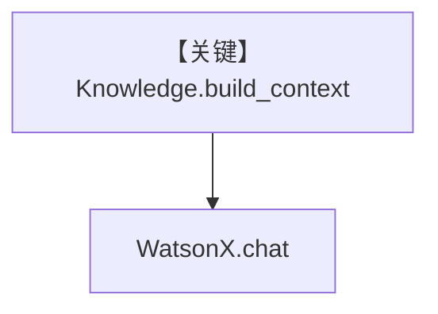

# knowledge.md — 实现原理分析

> 源文件：`cookbook/90_models/ibm/watsonx/knowledge.py`

## 概述

**`Knowledge` + PgVector + WatsonX**，与 Groq 版 Thai curry 流程相同，模型换为 **WatsonX**。

**核心配置一览：**

| 配置项 | 值 | 说明 |
|--------|-----|------|
| `model` | `WatsonX(id="mistralai/mistral-small-3-1-24b-instruct-2503")` | WatsonX |
| `knowledge` | `Knowledge(PgVector(...))` | RAG |

## System Prompt 组装

知识正文动态；验证方式同其他 RAG 示例。用户消息：`How to make Thai curry?`，`markdown=True` 在 `print_response`。

## 完整 API 请求

`WatsonX.client.chat` + 检索增强 system/user 组装。

## Mermaid 流程图

## 关键源码文件索引

| 文件 | 关键 |
|------|------|
| `agno/agent/_messages.py` | 3.3.13 |
