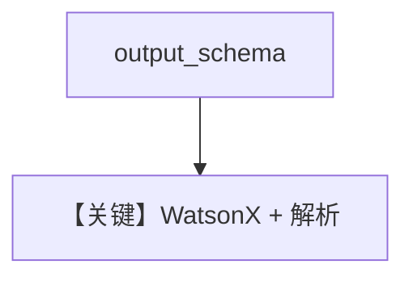

# structured_output.md — 实现原理分析

<!-- cookbook-py-source:start -->
## 完整源码

```python
"""
Ibm Structured Output
=====================

Cookbook example for `ibm/watsonx/structured_output.py`.
"""

from typing import List

from agno.agent import Agent, RunOutput  # noqa
from agno.models.ibm import WatsonX
from pydantic import BaseModel, Field
from rich.pretty import pprint  # noqa

# ---------------------------------------------------------------------------
# Create Agent
# ---------------------------------------------------------------------------


class MovieScript(BaseModel):
    setting: str = Field(
        ..., description="Provide a nice setting for a blockbuster movie."
    )
    ending: str = Field(
        ...,
        description="Ending of the movie. If not available, provide a happy ending.",
    )
    genre: str = Field(
        ...,
        description="Genre of the movie. If not available, select action, thriller or romantic comedy.",
    )
    name: str = Field(..., description="Give a name to this movie")
    characters: List[str] = Field(..., description="Name of characters for this movie.")
    storyline: str = Field(
        ..., description="3 sentence storyline for the movie. Make it exciting!"
    )


movie_agent = Agent(
    model=WatsonX(id="mistralai/mistral-small-3-1-24b-instruct-2503"),
    description="You help people write movie scripts.",
    output_schema=MovieScript,
)

# Get the response in a variable
# movie_agent: RunOutput = movie_agent.run("New York")
# pprint(movie_agent.content)

movie_agent.print_response("New York")

# ---------------------------------------------------------------------------
# Run Agent
# ---------------------------------------------------------------------------

if __name__ == "__main__":
    pass
```

<!-- cookbook-py-source:end -->

> 源文件：`cookbook/90_models/ibm/watsonx/structured_output.py`

## 概述

**`WatsonX` + `output_schema=MovieScript`**，**未** 设 `use_json_mode`（与 Groq 版对比）。

**核心配置一览：**

| 配置项 | 值 | 说明 |
|--------|-----|------|
| `model` | `WatsonX(...)` | WatsonX |
| `description` | `You help people write movie scripts.` | 角色 |
| `output_schema` | `MovieScript` | 结构化 |

## System Prompt 组装

### 还原 description 原样

```text
You help people write movie scripts.
```

框架按 `_messages.py` 3.3.15–3.3.16 追加 JSON/解析器提示（取决于 `parser_model` 与模型能力）。

用户消息：`New York`

## 完整 API 请求

`WatsonX.invoke` + `response_format` 由 Agent 传入（视结构化实现而定）。

## Mermaid 流程图



## 关键源码文件索引

| 文件 | 关键 |
|------|------|
| `agno/models/ibm/watsonx.py` | `_parse_provider_response` |
